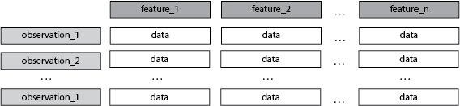
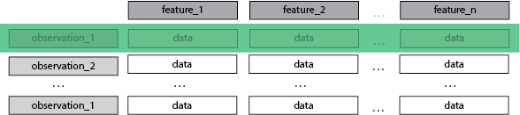
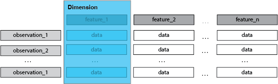
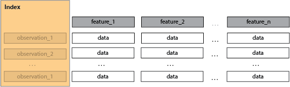
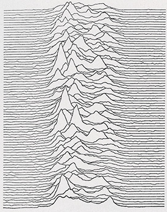
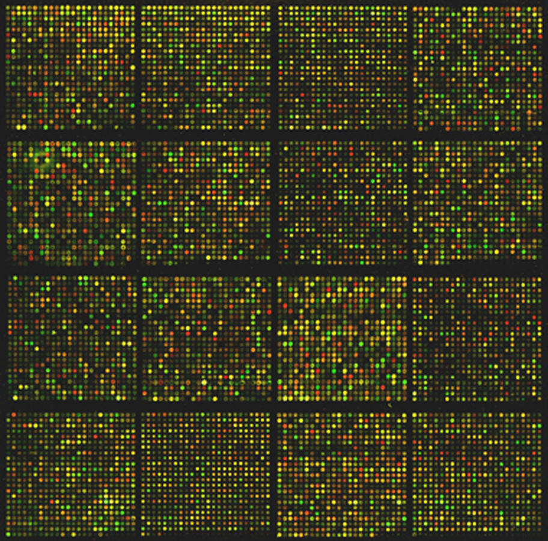

# Introduction - what is high dimensional data?

### What is data?

#### da·ta
/ˈdadə, ˈdādə/
_noun_
"the quantities, characters, or symbols on which operations are performed by a computer"

—Oxford Languages

(how is data formatted? structured, semi-structured, unstructured: flat file, json, raw text)

There is a conversion to numerical representation happening here

A rectangular dataset:
Original data set not rectangular, might require conversion that produces high dimensional rectangular data set.

We’re discussing structured, rectangular data only today.

## What is a dimension?

### di·men·sion
/dəˈmen(t)SH(ə)n, dīˈmen(t)SH(ə)n/

_noun_
noun: __dimension__; plural noun: __dimensions__
1. a measurable extent of some kind, such as length, breadth, depth, or height.
2. an aspect or feature of a situation, problem, or thing.

—Oxford Languages

# A Tabular/Rectangular Data Context
<!--  -->

Each *row* is an **observation**, is a **sample**.

Each *column* is a **feature**, is a **dimension**.

The *index* is not a dimension.

## A Dataset
1. Some number of observations > 1
2. every feature of an observation is a dimension
3. the number of observations i.e. the index, is not a dimension

# Examples of datasets with increasing dimensionality

### 1 D

1. likert scale question (index: respondent_id, question value (-3 to 3)

### 2 D

1. scatter plot (x, y)
2. two question survey (index: respondent_id, q1 answer, q2 answer)
3. data from temperature logger: (index: logged_value_id, time, value)

### 3 D

1. surface (x, y, z)
2. scatter plot with variable as size per point (x, y, size)
3. 2d black and white image (x, y, pixel_value)
4. moves log from a game of 'battleship' (index: move number, x-coord, y-coord, hit/miss)
5. [consecutive pulses of CP 1919](https://www.wemadethis.co.uk/blog/2015/03/unknown-pleasures-and-cp-1919/) (time, x, y)

            

# 4 D
1. surface plus coloration, (x, y, z, color_label)
3. surface change over time (x, y, z, time)

# 30 D
2. Brain connectivity analysis of 30 regions

# 20, 000 D
human gene expression e.g.

> ## Exercise - Battleship moves:
> discussion point is this 3d or 4d?
> 
> is the move number a dimension or an index?
>
> |move_id|column (A-J)|row (1-10)| hit |
> | :-: | :-: | :-: | :- |
> |0|A|1|False|
> |1|J|10|True|
> |2|C|7|False|
> |n|...|...|
>
> > ## Solution
> > ### 3d: move_id is an index!
> > 1. order sequence matters but not the specific value of the move number
> > 
> > ### 4d: move_id is a dimension!
> > 1. odd or even tells you which player is making which move
> > 2. order sequence is important, but when a specific moves get made might matter - what if you wanted to analyze moves as a function of game length?
> > 
> > ### There is always an index
> > 1. move_id is an index
> > 2. that doesn't mean there is no information there
> > 2. you can perform some feature engineering with move_id
> > 4. this would up the dimensionality of the inital 3d dataset perhaps adding two more dimensions:
> >     1. player
> >     2. player's move number
> {:.solution}
{:.challenge}

> ## Exercise - Film:
> consider a short, black and white, silent film, in 4K. It has the following properties:
> 1. 1 minute long
> 1. 25 frames per second
> 2. [4K resolution](https://en.wikipedia.org/wiki/4K_resolution) i.e. 4096 × 2160.
> 3. standard color depth 24 bits/pixel
>
> Think of this film as a dataset, How many observations might there be?
> > ## Solution: 
> > 60 seconds x 25 frames per second = 1500 frames or 'observations'.
> > Is there another way to think about this?
> {:.solution}
{:.challenge}

> ## Exercise: How many dimensions are there per observation?
> > ## Solution:
> > There are three dimensions per observation:
> > 
> > 1. pixel row (0-2159)
> > 2. pixel col (0-4095)
> > 3. pixel grey value (0-255)
> {:.solution}
{:.challenge}

> ## Exercise: How many dimensions would there be if the film was longer, or shorter?
> > ## Solution:
> > 1. The number of dimensions would NOT change.
> > 2. There would simply be a greater or fewer number of 'observations'
> {:.solution}
{:.challenge}

> ## Exercise: How many dimensions would there be if the film was in color?
> > ## Solution:
> > 4 dimensions.
> > 
> > There is an extra dimension per observation now.
> > 1. channel value (red, green, blue)
> > 2. pixel row (0-2159)
> > 3. pixel col (0-4095)
> > 4. pixel intensity (0-255)
> {:.solution}
{:.challenge}

> ## Exercise: Titanic dataset
> Look at the kaggle [Titantic Dataset](https://www.kaggle.com/competitions/titanic/data).
>
> | passenger_id | pclass |                         name                         |   sex  |  age | sibsp | parch | ticket |  fare  | cabin | embarked | boat | body |         home.dest        | survived |
> |:------------:|:------:|:----------------------------------------------------:|:------:|:----:|:-----:|:-----:|:------:|:------:|:-----:|:--------:|:----:|:----:|:------------------------:|:--------:|
> | 1216         | 3      | Smyth, Miss. Julia                                   | female |      | 0     | 0     | 335432 | 7.7333 |       | Q        | 13   |      |                          | 1        |
> | 699          | 3      | Cacic, Mr. Luka                                      | male   | 38.0 | 0     | 0     | 315089 | 8.6625 |       | S        |      |      | Croatia                  | 0        |
> | 1267         | 3      | Van Impe, Mrs. Jean Baptiste (Rosalie Paula Govaert) | female | 30.0 | 1     | 1     | 345773 | 24.15  |       | S        |      |      |                          | 0        |
> | 449          | 2      | Hocking, Mrs. Elizabeth (Eliza Needs)                | female | 54.0 | 1     | 3     | 29105  | 23.0   |       | S        | 4    |      | Cornwall / Akron, OH     | 1        |
> | 576          | 2      | Veal, Mr. James                                      | male   | 40.0 | 0     | 0     | 28221  | 13.0   |       | S        |      |      | Barre, Co Washington, VT | 0        |
>
> What column is the index?
> > ## Solution:
> > 
> >  PassengerId
> > 
> {:.solution}
{:.challenge}

> ## Exercise: What columns are the dimensions?
> > 
> > ## Solution:
> > 1. pclass
> > 2. name
> > 3. sex
> > 4. age
> > 5. sibsp
> > 6. parch
> > 7. ticket
> > 8. fare
> > 9. cabin
> > 10. embarked
> > 11. survived
> > 
> {:.solution}
{:.challenge}

> ## Exercise: how many dimensions are there?
> > ## Solution:
> >
> > 11
> >
> {:.solution}
{:.challenge}

> ## Exercise: Imagine building a model to predict survival on the titantic
>
> 1. would you use every dimension?
> 2. what makes a dimension useful?
> 3. could you remove some dimensions?
> 4. could you combine some dimensions?
> 5. how would you combine those dimensions?
> 6. do you have fewer dimensions after combining?
> 7. do you have less information after combining?
>
> > ## Solution:
> >
> > 1. No, some variables are poor predictors and can be ignored
> > 2. If it is (anti-)correlated with survival (in some context) i.e. has information.
> > 3. Yes any mostly null columns are not useful (add no information), any highly correlated columns also (no additional information)
> > 4. Yes
> > 5. Maybe add SibSp and Parch into one 'family count'.
> > 6. Yes.
> > 7. Yes, but more data than if columns had been excluded.
> >
> {:.solution}
{:.challenge}

# End of part 1
in part two we'll start exploring a new dataset
