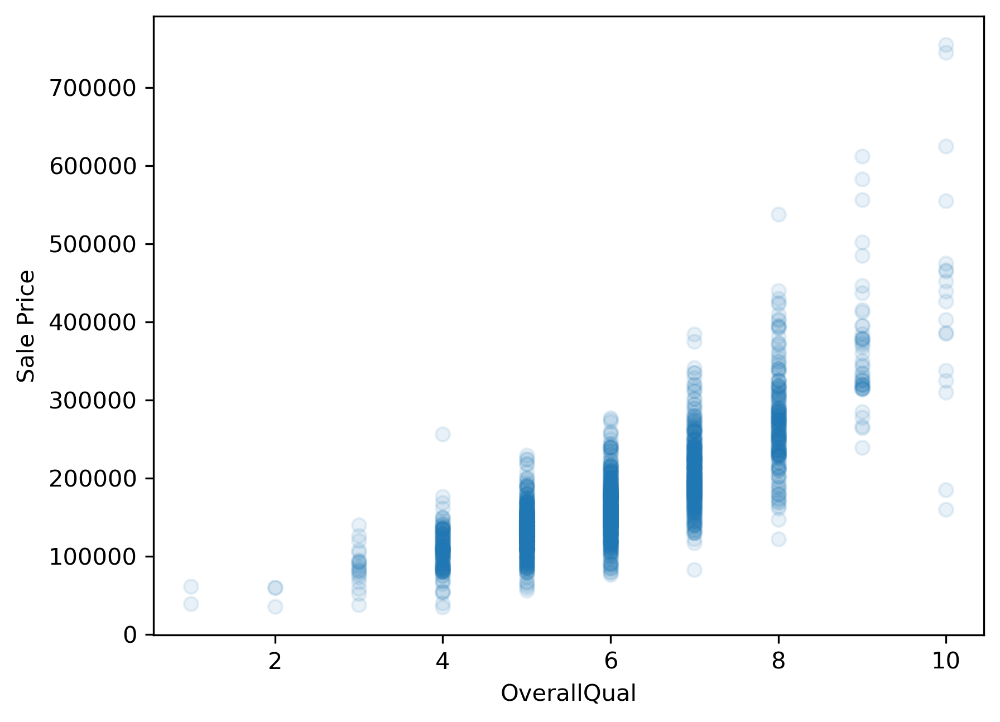
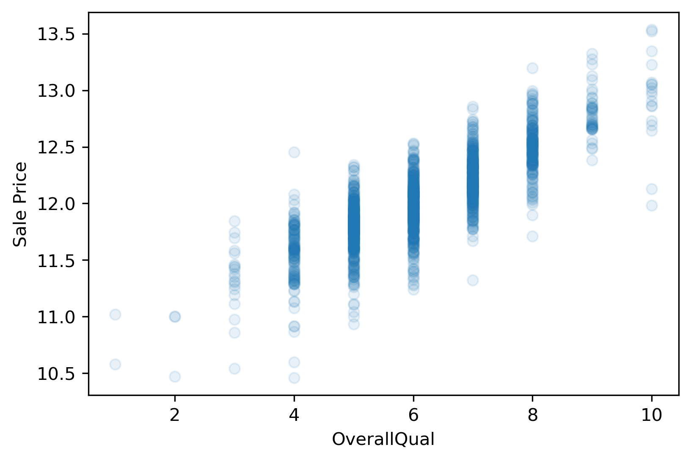
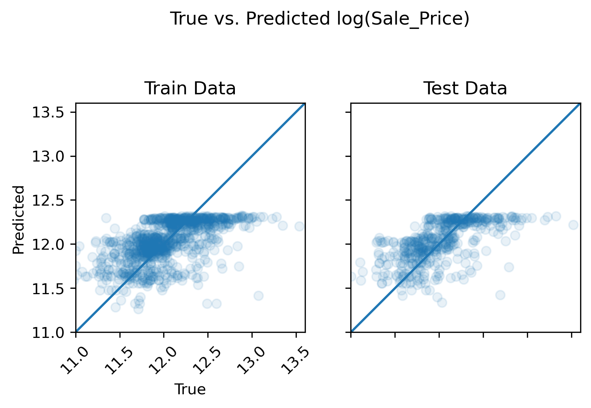
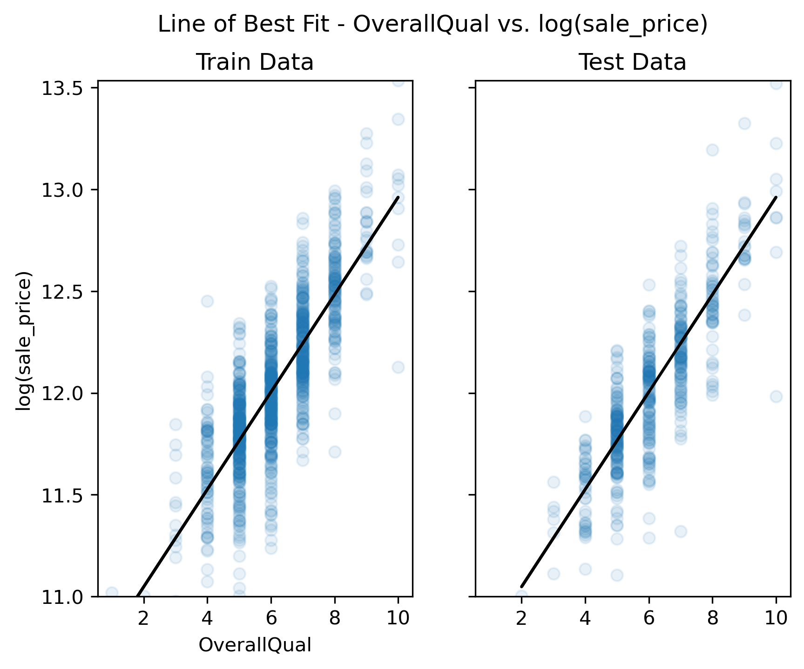

# Linear Regression
Linear regression is powerful technique that is often used to understand whether and how certain *predictor variables* (e.g., garage size, year built, etc.) in a dataset **linearly relate** to some *target variable* (e.g., house sale prices). Starting with linear models when working with high-dimensional data can offer several advantages including:

* Simplicity and Interpretability: Linear models, such as linear regression, are relatively simple and interpretable. They provide a clear understanding of how each predictor variable contributes to the outcome, which can be especially valuable in exploratory analysis.

* Baseline Understanding: Linear models can serve as a baseline for assessing the predictive power of individual features. This baseline helps you understand which features have a significant impact on the target variable and which ones might be less influential.

* Feature Selection: Linear models can help you identify relevant features by looking at the estimated coefficients. Features with large coefficients are likely to have a stronger impact on the outcome, while those with small coefficients might have negligible effects

While linear models have their merits, it's important to recognize that they might not capture complex (nonlinear) relationships present in the data. However, they are often the best option available when working in a high-dimensional context unless data is extremely limited.

##  Goals of Linear Regression
By fitting linear models to the Ames housing dataset, we can...

1. **Predict**: Use predictive modeling to predict hypothetical/future sale prices based on observed values of the predictor variables in our dataset (e.g., garage size, year built, etc.).
2. **Explain**: Use statistics to make scientific claims concerning which predictor variables have a significant impact on sale price — the target variable (a.k.a. response / dependent variable)

**"Target" and "Predictor" Synonyms**
* Predictor = independent = feature
* Target = dependent = response = outcome

In this workshop, we will explore how we can exploit well-established machine learning methods, including *feature selection*, and *regularization techniques* (more on these terms later), to achieve both of the above goals on high-dimensional datasets.

> ## To predict or explain. That is the question.
> When trying to model data you use in your work, which goal is typically more prevalent? Do you typically care more about (1) accurately predicting some target variable or (2) making scientific claims concerning the existence of certain relationships between variables?
> > ## Solution
> >
> > In a research setting, explaining relationships typically takes higher priority over predicting since explainations hold high value in science, but both goals are sometimes relevant. In industry, the reverse is typically true as many industry applications place predictive accuracy above explainability. We will explore how these goals align and sometimes diverge from one another throughout the remaining lessons.
> {:.solution}
{:.challenge}


### Predicting housing prices with a single predictor
We'll start with the first goal: prediction. How can we use regression models to predict housing sale prices? For clarity, we will begin this question through the lens of simple univariate regression models.

We'll start by loading in the Ames housing data as we have done previously in this workshop.


```python
from sklearn.datasets import fetch_openml
housing = fetch_openml(name="house_prices", as_frame=True, parser='auto') #
```

#### Extract predictor variable and target variable from dataframe
Next, we'll extract the two variables we'll use for our model — the target variable that we'll attempt to predict (SalePrice), and a single predictor variable that will be used to predict the target variable. For this example, we'll explore how well the "OverallQual" variable (i.e., the predictor variable) can predict sale prices.

**OverallQual**: Rates the overall material and finish of the house

       10	Very Excellent
       1	Very Poor


```python
# Extract x (predictor) and y (target)
y = housing['target']
predictor = 'OverallQual'
x = housing['data'][predictor]
```

#### Visualize the relationship between x and y
Before fitting any models in a univariate context, we should first explore the data to get a sense for the relationship between the predictor variable, "OverallQual", and the response variable, "SalePrice". If this relationship does not look linear, we won't be able to fit a good linear model (i.e., a model with low average prediction error in a predictive modeling context) to the data.


```python
import matplotlib.pyplot as plt
plt.scatter(x,y, alpha=.1)
plt.xlabel(predictor)
plt.ylabel('Sale Price');
# plt.savefig('..//fig//regression//scatterplot_x_vs_salePrice.png', bbox_inches='tight', dpi=300, facecolor='white');
```




Unfortunately, sale price appears to grow almost exponentially—not linearly—with the predictor variable. Any line we draw through this data cloud is going to fail in capturing the true trend we see here.

##### Log scaling
How can we remedy this situation? One common approach is to log transform the target variable. We’ll convert the "SalePrice" variable to its logarithmic form by using the math.log() function. Pandas has a special function called apply which can apply an operation to every item in a series by using the statement y.apply(math.log), where y is a pandas series.


```python
import numpy as np
y_log = y.apply(np.log)
```


```python
plt.scatter(x,y_log, alpha=.1)
plt.xlabel(predictor)
plt.ylabel('Sale Price');
# plt.savefig('..//fig//regression//scatterplot_x_vs_logSalePrice.png', bbox_inches='tight', dpi=300, facecolor='white')
```




This plot looks much better than the previous one. That is, the trend between OverallQual and log(SalePrice) appears fairly linear. Whether or not it is sufficiently linear can be addressed when we evaluate the model's performance later.

#### 3) Train/test split
Next, we will prepare two subsets of our data to be used for *model-fitting* and *model evaluation*. This process is standard for any predictive modeling task that involves a model "learning" from observed data (e.g., fitting a line to the observed data).

During the model-fitting step, we use a subset of the data referred to as **training data** to estimate the model's coefficients (the slope of the model). The univariate model will find a line of best fit through this data.

Next, we can assess the model's ability to generalize to new datasets by measuring its performance on the remaining, unseen data. This subset of data is referred to as the **test data** or holdout set. By evaluating the model on the test set, which was not used during training, we can obtain an unbiased estimate of the model's performance.

If we were to evaluate the model solely on the training data, it could lead to **overfitting**. Overfitting occurs when the model learns the noise and specific patterns of the training data too well, resulting in poor performance on new data. By using a separate test set, we can identify if the model has overfit the training data and assess its ability to generalize to unseen samples. While overfitting is typically not likely to occur when using only a single predictor variable, it is still a good idea to use a train/test split when fitting univariate models. This can help in detecting unanticipated issues with the data, such as missing values, outliers, or other anomalies that affect the model's behavior.


The below code will split our dataset into a training dataset containing 2/3 of the samples, and a test set containing the remaining 1/3 of the data. We'll discuss these different subsets in more detail in just a bit.


```python
from sklearn.model_selection import train_test_split

x_train, x_test, y_train, y_test = train_test_split(x, y_log,
                                                    test_size=0.33,
                                                    random_state=0)

print(x_train.shape)
print(x_test.shape)
```

    (978,)
    (482,)


Reshape single-var predictor matrix in preparation for model-fitting step (requires a 2-D representation)


```python
x_train = x_train.values.reshape(-1,1)
x_test = x_test.values.reshape(-1,1)
print(x_train.shape)
print(x_test.shape)
```

    (978, 1)
    (482, 1)


#### 4) Fit the model to the training dataset

During the model fitting step, we use a subset of the data referred to as **training data** to estimate the model's coefficients. The univariate model will find a line of best fit through this data.

##### The sklearn library
When fitting linear models solely for predictive purposes, the scikit-learn or "sklearn" library is typically used. Sklearn offers a broad spectrum of machine learning algorithms beyond linear regression. Having multiple algorithms available in the same library allows you to switch between different models easily and experiment with various techniques without switching libraries. Sklearn is also optimized for performance and efficiency, which is beneficial when working with large datasets. It can efficiently handle large-scale linear regression tasks, and if needed, you can leverage tools like NumPy and SciPy, which are well-integrated with scikit-learn for faster numerical computations.


```python
from sklearn.linear_model import LinearRegression
reg = LinearRegression().fit(x_train,y_train)
```

#### 5) Get model predictions for train and test data


```python
y_pred_train=reg.predict(x_train)
y_pred_test=reg.predict(x_test)
```

#### 6) Plot the data vs predictions - qualitative assessment


```python
from regression_predict_sklearn import plot_train_test_predictions
(fig1, fig2) = plot_train_test_predictions(predictors=[predictor],
                                           X_train=x_train, X_test=x_test,
                                           y_train=y_train, y_test=y_test,
                                           y_pred_train=y_pred_train, y_pred_test=y_pred_test,
                                           log_scaled=True);

# print(type(fig1))
# import matplotlib.pyplot as plt
# import pylab as pl
# pl.figure(fig1.number)
# plt.savefig('..//fig//regression//univariate_truePrice_vs_predPrice.png',bbox_inches='tight', dpi=300)
# pl.figure(fig2.number)
# plt.savefig('..//fig//regression//univariate_x_vs_predPrice.png',bbox_inches='tight', dpi=300)

```





> ## Inspect the plots
> 1. Does the model capture the variability in sale prices well? Would you use this model to predict the sale price of a house? Why or why not?
> 
> 2. Does the model seem to exhibit any signs of overfitting? What about underfitting?
> 
> 3. How might you improve the model?
> 
> > ## Solution
> >
> > 1. Based on visual inspection, this linear model does a fairly good job in capturing the relationship between "OverallQual" and sale price. While sales price appears to follow a predictable trend, it may be best to first quantitatively evaluate the model before overrelying on its predictions.
> > 
> > 2. Since the train and test set plots look very similar, overfitting is not a concern. Generally speaking, overfitting is not encountered with univariate models unless you have an incredily small number of samples to train the model on. Since the model follows the trajectory of sale price reasonably well, it also does not appear to underfit the data (at least not to an extreme extent).
> > 
> > 3. In order to improve this model, we can ask ourselves — is "OverallQual" likely the only variable that contributes to final sale price, or should we consider additional predictor variables? Most outcome variables can be influenced by more than one predictor variable. By accounting for all predictors that have an impact on sales price, we can improve the model.
> > 
> {:.solution}
{:.challenge}


#### 5) Measure model error and assess under/overfitting
While qualitative examinations of model performance are extremely helpful, it is always a good idea to pair such evaluations with a quantitative analysis of the model's performance.

**Convert back to original data scale**
There are several error measurements that can't be used to measure a regression model's performance. Before we implement any of them, we'll first convert the log(salePrice) back to original sale price for ease of interpretation.


```python
salePrice_train = np.exp(y_train)
pred_salePrice_train = np.exp(y_pred_train)

salePrice_test = np.exp(y_test)
pred_salePrice_test = np.exp(y_pred_test)
```

**Measure baseline performance**


```python
from math import sqrt
import pandas as pd

mean_sale_price = y.mean()
print('mean sale price =', mean_sale_price)

# convert to series same length as y sets for ease of comparison
mean_sale_price = pd.Series(mean_sale_price)
mean_sale_price = mean_sale_price.repeat(len(y))
```

    mean sale price = 180921.19589041095


**Root Mean Squared Error (RMSE)**:
The RMSE provides an easy-to-interpret number that represents error in terms of the units of the target variable. With our univariate model, the "YearBuilt" predictor variable (a.k.a. model feature) predicts sale prices within +/- $68,106 from the true sale price. We always use the RMSE of the test set to assess the model's ability to generalize on unseen data. An extremely low prediction error in the train set is also a good indicator of overfitting.


```python
from sklearn import metrics

RMSE_baseline = metrics.mean_squared_error(y, mean_sale_price, squared=False)
RMSE_train = metrics.mean_squared_error(salePrice_train, pred_salePrice_train, squared=False)
RMSE_test = metrics.mean_squared_error(salePrice_test, pred_salePrice_test, squared=False)

print(f"Baseline RMSE = {RMSE_baseline}")
print(f"Train RMSE = {RMSE_train}")
print(f"Test RMSE = {RMSE_test}")
```

    Baseline RMSE = 79415.29188606751
    Train RMSE = 45534.34940950763
    Test RMSE = 44762.77229823455


Here, both train and test RMSE are very similar to one another. As expected with most univariate models, we do not see any evidence of overfitting. This model performs substantially better than the baseline. However, an average error of +/- $44,726 is likely too high for this model to be useful in practice. That is, the model is underfitting the data given its poor ability to predict the true housing prices.

**Mean Absolute Percentage Error**:
What if we wanted to know the percent difference between the true sale price and the predicted sale price? For this, we can use the **mean absolute percentage error (MAPE)**...


```python
MAPE_baseline = metrics.mean_absolute_percentage_error(y, mean_sale_price)
MAPE_train = metrics.mean_absolute_percentage_error(salePrice_train, pred_salePrice_train)
MAPE_test = metrics.mean_absolute_percentage_error(salePrice_test, pred_salePrice_test)
print(f"Baseline MAPE = {MAPE_baseline*100}")
print(f"Train MAPE = {MAPE_train*100}")
print(f"Test MAPE = {MAPE_test*100}")
```

    Baseline MAPE = 36.3222261212389
    Train MAPE = 18.75854039670096
    Test MAPE = 16.753971728816907


With the MAPE measurement (max value of 1 which corresponds to 100%), we can state that our model over/under estimates sale prices by an average of 23.41% (25.28%) across all houses included in the test set (train set). Certainly seems there is room for improvement based on this measure.

**R-Squared**: Another useful error measurement to use with regression models is the coefficient of determination — $R^2$. Oftentimes pronounced simply "R-squared",  this measure assesses the proportion of the variation in the target variable that is predictable from the predictor variable(s). Using sklearn's metrics, we can calculate this as follows:


```python
R2_baseline = metrics.r2_score(y, mean_sale_price)
R2_train = metrics.r2_score(y_train, y_pred_train)
R2_test = metrics.r2_score(y_test, y_pred_test)
print(f"Baseline R-squared = {R2_baseline}")
print(f"Train R-squared = {R2_train}")
print(f"Test R-squared = {R2_test}")

```

    Baseline R-squared = 0.0
    Train R-squared = 0.6521389099611015
    Test R-squared = 0.7012721408788911


Our model predicts 70.1% (65.2%) of the variance across sale prices in the test set (train set). The R-squared for the baseline model is 0 because the numerator and denominator in the equation for R-squared are equivalent:

### R-squared equation: R-squared = 1 - (Sum of squared residuals) / (Total sum of squares)

**Sum of Squared Residuals (SSR)**:
SSR = Sum of (Actual Value - Predicted Value)^2 for all data points. The Sum of Squared Residuals (SSR) is equivalent to the variance of the residuals in a regression model. Residuals are the differences between the actual observed values and the predicted values produced by the model. Squaring these differences and summing them up yields the SSR.

**Total Sum of Squares (TSS)**:
TSS = Sum of (Actual Value - Mean of Actual Values)^2 for all data points. The TSS represents the total variability or dispersion in the observed values of the target variable. It measures the total squared differences between each data point's value and the mean of the observed values.

To read more about additional error/loss measurements, visit [sklearn's metrics documentation](https://scikit-learn.org/stable/modules/model_evaluation.html).

> ## More on R-squared
> Our above example model is able to explain roughly 70.1% of the variance in the test dataset. Is this a “good” value for R-squared?
> 
> > ## Solution
> >
> > The answer to this question depends on your objective for the regression model. This relates back to the two modeling goals of *explaining* vs *predicting*. Depending on the objective, the answer to "What is a good value for R-squared?" will be different.
> > 
> > **Predicting the response variable:**
> > If your main objective is to predict the value of the response variable accurately using the predictor variable, then R-squared is important. The value for R-squared can range from 0 to 1. A value of 0 indicates that the response variable cannot be explained by the predictor variable at all. A value of 1 indicates that the response variable can be perfectly explained without error by the predictor variable. In general, the larger the R-squared value, the more precisely the predictor variables are able to predict the value of the response variable. How high an R-squared value needs to be depends on how precise you need to be for your specific model's application. To find out what is considered a “good” R-squared value, you will need to explore what R-squared values are generally accepted in your particular field of study.
> > 
> > **Explaining the relationship between the predictor(s) and the response variable:**
> > If your main objective for your regression model is to explain the relationship(s) between the predictor(s) and the response variable, the R-squared is mostly irrelevant. A predictor variable that consistently relates to a change in the response variable (i.e., has a statistically significant effect) is typically always interesting — regardless of the the effect size. The exception to this rule is if you have a near-zero R-squared, which suggests that the model does not explain any of the variance in the data.
> > 
> {:.solution}
{:.challenge}


#### Comparing univariate models

1. Use get_feat_types() to get a list of continuous predictors
2. Create an X variable containing only continuous predictors from `housing['data']`
3. Extract sale prices from `housing['target']` and log scale it
4. Use the remove_bad_cols helper function to remove predictors with nans or containing > 97% constant values (typically 0's)
4. Perform a train/test split leaving 1/3 of the data out for the test set
5. Call the `fit_eval_model()` helper function for each predictor being tested. Store the train/test errors for each predictor
6. Create a `df_model_err` df that contains the following data stored for each predictor: 'Predictor Variable', 'RMSE_train', 'Test RMSE'.


```python
# preprocess
from preprocessing import get_feat_types
predictor_type_dict = get_feat_types()
continuous_fields = predictor_type_dict['continuous_fields']
X = housing['data'][continuous_fields]
y_log = np.log(housing['target'])

# remove columns with nans or containing > 97% constant values (typically 0's)
from preprocessing import remove_bad_cols
X_good = remove_bad_cols(X, .9)

# train/test split
X_train, X_test, y_train, y_test = train_test_split(X_good, y_log,
                                                    test_size=1/3,
                                                    random_state=0)

```

    LotFrontage contains 259 NAs
    MasVnrArea contains 8 NAs
    LowQualFinSF sparsity = 0.9821917808219178
    BsmtHalfBath sparsity = 0.9438356164383561
    KitchenAbvGr sparsity = 0.0006849315068493151
    GarageYrBlt contains 81 NAs
    3SsnPorch sparsity = 0.9835616438356164
    ScreenPorch sparsity = 0.9205479452054794
    PoolArea sparsity = 0.9952054794520548
    # of columns removed: 9
    Columns removed: ['LotFrontage', 'MasVnrArea', 'LowQualFinSF', 'BsmtHalfBath', 'KitchenAbvGr', 'GarageYrBlt', '3SsnPorch', 'ScreenPorch', 'PoolArea']


```python
RMSE_train_list=[None] * len(X_train.columns)
RMSE_test_list=[None] * len(X_train.columns)
```


```python
from regression_predict_sklearn import fit_eval_model

feat_index=0
for feat in X_train.columns:
    # fit univariate model and return train/test RMSE
    RMSE_train, RMSE_test = fit_eval_model(X_train=X_train, y_train=y_train,
                                           X_test=X_test, y_test=y_test,
                                           predictors=[feat],
                                           metric='RMSE', log_scaled=True,
                                           model_type='unregularized', include_plots=False)
    print('')
    # store model errors
    RMSE_train_list[feat_index] = RMSE_train
    RMSE_test_list[feat_index] = RMSE_test#metrics.mean_squared_error(y_test, predicted_test,squared=False) # squared=False to get RMSE instead of MSE
    feat_index+=1

# store errors in pandas dataframe for ease of access downstream
df_model_err = pd.DataFrame()
df_model_err['Predictor Variable'] = X_train.columns
df_model_err['Train RMSE'] = RMSE_train_list
df_model_err['Test RMSE'] = RMSE_test_list
```

    # of predictor vars = 1 (LotArea)
    # of train observations = 973
    # of test observations = 487
    Train RMSE = 83028.37305855636
    Test RMSE = 80420.2670800344
    (Test-Train)/Train: -3%

    # of predictor vars = 1 (YearBuilt)
    # of train observations = 973
    # of test observations = 487
    Train RMSE = 67215.86073110496
    Test RMSE = 67183.55371908506
    (Test-Train)/Train: -0%

    # of predictor vars = 1 (YearRemodAdd)
    # of train observations = 973
    # of test observations = 487
    Train RMSE = 68425.7461018627
    Test RMSE = 70019.97319311542
    (Test-Train)/Train: 2%

    # of predictor vars = 1 (OverallQual)
    # of train observations = 973
    # of test observations = 487
    Train RMSE = 45623.065303950156
    Test RMSE = 44642.13568108219
    (Test-Train)/Train: -2%

    # of predictor vars = 1 (OverallCond)
    # of train observations = 973
    # of test observations = 487
    Train RMSE = 80366.68673923709
    Test RMSE = 81631.48127835637
    (Test-Train)/Train: 2%

    # of predictor vars = 1 (BsmtFinSF1)
    # of train observations = 973
    # of test observations = 487
    Train RMSE = 72748.93172833491
    Test RMSE = 84771.1336800596
    (Test-Train)/Train: 17%

    # of predictor vars = 1 (BsmtFinSF2)
    # of train observations = 973
    # of test observations = 487
    Train RMSE = 80295.68858571006
    Test RMSE = 81327.64920427596
    (Test-Train)/Train: 1%

    # of predictor vars = 1 (BsmtUnfSF)
    # of train observations = 973
    # of test observations = 487
    Train RMSE = 78478.49546769331
    Test RMSE = 79032.7639585704
    (Test-Train)/Train: 1%

    # of predictor vars = 1 (TotalBsmtSF)
    # of train observations = 973
    # of test observations = 487
    Train RMSE = 62981.24495506702
    Test RMSE = 170676.30200173028
    (Test-Train)/Train: 171%

    # of predictor vars = 1 (1stFlrSF)
    # of train observations = 973
    # of test observations = 487
    Train RMSE = 64348.596396317
    Test RMSE = 90726.32385904736
    (Test-Train)/Train: 41%

    # of predictor vars = 1 (2ndFlrSF)
    # of train observations = 973
    # of test observations = 487
    Train RMSE = 75117.80767062792
    Test RMSE = 77249.37774777155
    (Test-Train)/Train: 3%

    # of predictor vars = 1 (GrLivArea)
    # of train observations = 973
    # of test observations = 487
    Train RMSE = 59694.54179405045
    Test RMSE = 88001.68930541775
    (Test-Train)/Train: 47%

    # of predictor vars = 1 (BsmtFullBath)
    # of train observations = 973
    # of test observations = 487
    Train RMSE = 78071.07788085632
    Test RMSE = 79234.17602495886
    (Test-Train)/Train: 1%

    # of predictor vars = 1 (FullBath)
    # of train observations = 973
    # of test observations = 487
    Train RMSE = 64947.13616029772
    Test RMSE = 67724.41387357097
    (Test-Train)/Train: 4%

    # of predictor vars = 1 (HalfBath)
    # of train observations = 973
    # of test observations = 487
    Train RMSE = 76875.2154503375
    Test RMSE = 78089.50157989419
    (Test-Train)/Train: 2%

    # of predictor vars = 1 (BedroomAbvGr)
    # of train observations = 973
    # of test observations = 487
    Train RMSE = 78859.0099196976
    Test RMSE = 80928.58649269452
    (Test-Train)/Train: 3%

    # of predictor vars = 1 (TotRmsAbvGrd)
    # of train observations = 973
    # of test observations = 487
    Train RMSE = 67314.34638993855
    Test RMSE = 70487.08719845899
    (Test-Train)/Train: 5%

    # of predictor vars = 1 (Fireplaces)
    # of train observations = 973
    # of test observations = 487
    Train RMSE = 71383.16839222088
    Test RMSE = 72654.45183574369
    (Test-Train)/Train: 2%

    # of predictor vars = 1 (GarageCars)
    # of train observations = 973
    # of test observations = 487
    Train RMSE = 58760.717829791596
    Test RMSE = 62329.76283145285
    (Test-Train)/Train: 6%

    # of predictor vars = 1 (GarageArea)
    # of train observations = 973
    # of test observations = 487
    Train RMSE = 60861.68865273488
    Test RMSE = 68169.47489305338
    (Test-Train)/Train: 12%

    # of predictor vars = 1 (WoodDeckSF)
    # of train observations = 973
    # of test observations = 487
    Train RMSE = 76667.47730395387
    Test RMSE = 76269.68336294664
    (Test-Train)/Train: -1%

    # of predictor vars = 1 (OpenPorchSF)
    # of train observations = 973
    # of test observations = 487
    Train RMSE = 77211.32431815827
    Test RMSE = 77835.48585472786
    (Test-Train)/Train: 1%

    # of predictor vars = 1 (EnclosedPorch)
    # of train observations = 973
    # of test observations = 487
    Train RMSE = 79649.97674905702
    Test RMSE = 80370.50946830492
    (Test-Train)/Train: 1%

    # of predictor vars = 1 (YrSold)
    # of train observations = 973
    # of test observations = 487
    Train RMSE = 80208.64778880267
    Test RMSE = 81384.86909780584
    (Test-Train)/Train: 1%

    # of predictor vars = 1 (MoSold)
    # of train observations = 973
    # of test observations = 487
    Train RMSE = 80211.76963270074
    Test RMSE = 81188.01231524699
    (Test-Train)/Train: 1%


```python
from regression_predict_sklearn import compare_univariate_models_plot
sorted_predictors = compare_univariate_models_plot(df_model_err)
```

    45623.065303950156
    44642.13568108219


### Examing the worst/best performers


```python
feat_index=0
for feat in sorted_predictors[-5:]:
    # fit univariate model and return train/test RMSE
    RMSE_train, RMSE_test = fit_eval_model(X_train=X_train, y_train=y_train,
                                           X_test=X_test, y_test=y_test,
                                           predictors=[feat],
                                           metric='RMSE', log_scaled=True,
                                           model_type='unregularized', include_plots=True)
    print('')
    # store model errors
    RMSE_train_list[feat_index] = RMSE_train
    RMSE_test_list[feat_index] = RMSE_test#metrics.mean_squared_error(y_test, predicted_test,squared=False) # squared=False to get RMSE instead of MSE
    feat_index+=1

# store errors in pandas dataframe for ease of access downstream
df_model_err = pd.DataFrame()
df_model_err['Predictor Variable'] = X_train.columns
df_model_err['Train RMSE'] = RMSE_train_list
df_model_err['Test RMSE'] = RMSE_test_list
```

    # of predictor vars = 1 (OverallCond)
    # of train observations = 973
    # of test observations = 487
    Train RMSE = 80366.68673923709
    Test RMSE = 81631.48127835637
    (Test-Train)/Train: 2%


    # of predictor vars = 1 (BsmtFinSF1)
    # of train observations = 973
    # of test observations = 487
    Train RMSE = 72748.93172833491
    Test RMSE = 84771.1336800596
    (Test-Train)/Train: 17%


    # of predictor vars = 1 (GrLivArea)
    # of train observations = 973
    # of test observations = 487
    Train RMSE = 59694.54179405045
    Test RMSE = 88001.68930541775
    (Test-Train)/Train: 47%


    # of predictor vars = 1 (1stFlrSF)
    # of train observations = 973
    # of test observations = 487
    Train RMSE = 64348.596396317
    Test RMSE = 90726.32385904736
    (Test-Train)/Train: 41%


    # of predictor vars = 1 (TotalBsmtSF)
    # of train observations = 973
    # of test observations = 487
    Train RMSE = 62981.24495506702
    Test RMSE = 170676.30200173028
    (Test-Train)/Train: 171%


#### 7) Explaining models
At this point, we have assessed the predictive accuracy of our model. However, what if we want to interpret our model to understand which predictor(s) have a consistent or above chance (i.e., statistically significant) impact sales price? For this kind of question and other questions related to model interpretability, we need to first carefully validate our model. The next two episodes will explore some of the necessary checks you must perform before reading too far into your model's estimations.
