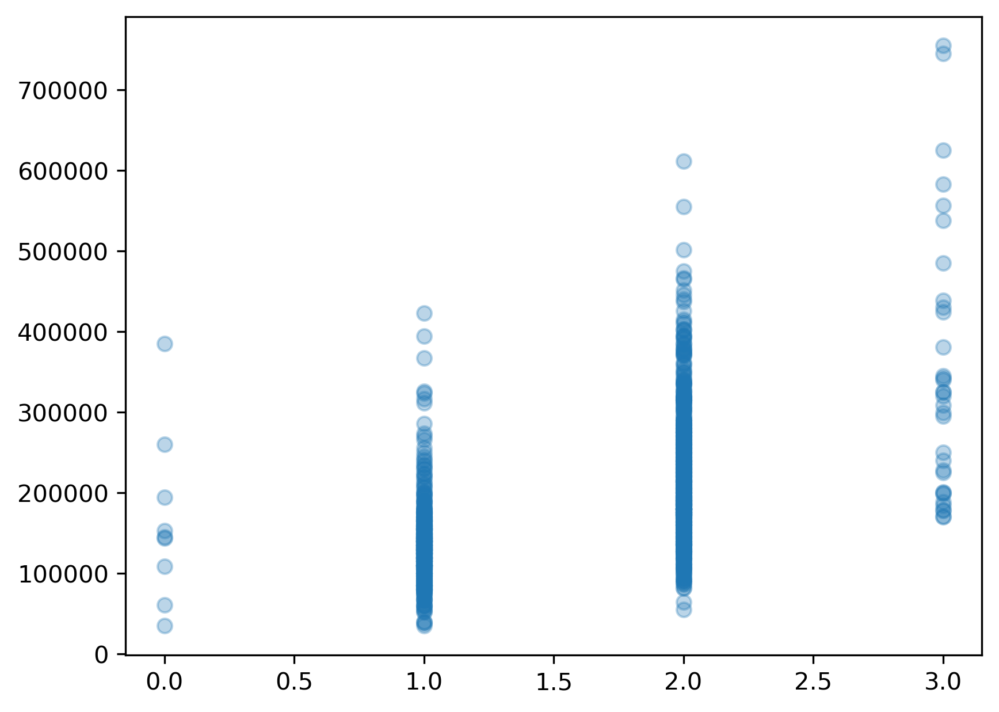
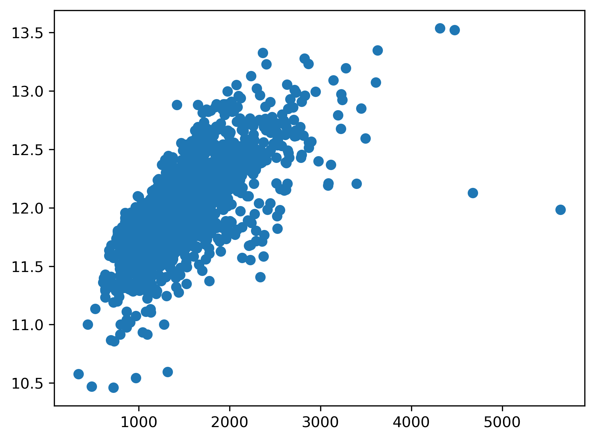

### Model Validity And Interpretation
While using models strictly for predictive purposes is a completely valid approach for some domains and problems, researchers typically care more about being able to interpret their models such that interesting relationships between predictor(s) and target can be discovered and measured. When interpretting a linear regression model, we can look at the model's estimated coefficients and p-values associated with each predictor to better understand the model. The coefficient's magnitude can inform us of the effect size associated with a predictor, and the p-value tells us whether or not a predictor has a consistent (statistically significant) effect on the target.

**Before we can blindly accept the model's estimated coefficients and p-values, we must answer three questions that will help us determine whether or not our model is valid.**

#### Model Validity Assessments
1. **Accounting for relevant predictors**: Have we included all relevant predictors in the model?
2. **Bias/variance or under/overfitting**: Does the model capture the variability of the target variable well? Does the model generalize well?
3. **Model assumptions**: Does the fitted model follow the 5 assumptions of linear regression?

We will discuss the first two assessments in detail throughout this episode.

### 1. Relevant predictors

> ## Benefits and drawbacks of including all relevant predcitors
> What do you think might be some benefits of including all relevant predictors in a model that you intend to use to **explain** relationships? Are there any drawbacks you can think of?
> > ## Solution
> >
> > Including all relevant predictor variables in a model is important for several reasons:
> > 
> > 1. **Improving model interpretability**: Leaving out relevant predictors can result in *model misspecification*. Misspecification refers to a situation where the model structure or functional form does not accurately reflect the underlying relationship between the predictors and the outcome. If a relevant predictor is omitted from the model, the coefficients of the remaining predictors may be biased. This occurs because the omitted predictor may have a direct or indirect relationship with the outcome variable, and its effect is not accounted for in the model. Consequently, the estimated coefficients of other predictors may capture some of the omitted predictor's effect, leading to biased estimates.
> > 
> > 2. **Improving predicitive accuracy and reducing residual variance**: Omitting relevant predictors can increase the residual variance in the model. Residual variance represents the unexplained variation in the outcome variable after accounting for the predictors in the model. If a relevant predictor is left out, the model may not fully capture the systematic variation in the data, resulting in larger residuals and reduced model fit. While it is true that, in a research setting, we typically care more about being able to interpret our model than being able to perfectly predict the target variable, a model that severely underfits is still a cause for concern since the model won't be capturing the variability of the data well enough to form any conclusions.
> > 
> > 3. **Robustness to future changes**: This benefit only applies to predictive modeling tasks where models are often being fit to new data. By including all relevant predictors, the model becomes more robust to changes in the data or the underlying system. If a predictor becomes important in the future due to changes in the environment or additional data, including it from the start ensures that the model is already equipped to capture its influence.
> > 
> > **Drawbacks to including all relevant predictors:** While one should always aim to include as many relevant predictors as possible, this goal needs to be balanced with overfitting concerns. If we include too many predictors in the model and train on a limited number of observations, the model may simply memorize the nuances/noise in the data rather than capturing the underlying trend in the data.
> {:.solution}
{:.challenge}


#### Example
Let's consider a regression model where we want to evaluate the relationship between FullBath (number of bathrooms) and SalePrice.


```python
from sklearn.datasets import fetch_openml
housing = fetch_openml(name="house_prices", as_frame=True, parser='auto') #
y=housing['target']
X=housing['data']['FullBath']
print(X.shape)
X.head()
```

    (1460,)


    0    2
    1    2
    2    2
    3    1
    4    2
    Name: FullBath, dtype: int64


It's always a good idea to start by plotting the predictor vs the target variable to get a sense of the underlying relationship.


```python
import matplotlib.pyplot as plt
plt.scatter(X,y,alpha=.3);
# plt.savefig('..//fig//regression//relevant_predictors//scatterplot_fullBath_vs_salePrice.png', bbox_inches='tight', dpi=300, facecolor='white');
```




Since the relationship doesn't appear to be quite as linear as we were hoping, we will try a log transformation as we did in the previous episode.


```python
import numpy as np
y_log = y.apply(np.log)
plt.scatter(X,y_log, alpha=.3);
# plt.savefig('..//fig//regression//relevant_predictors//scatterplot_fullBath_vs_logSalePrice.png', bbox_inches='tight', dpi=300, facecolor='white');
```


The log transform improves the linear relationship substantially!

### Standardizing scale of predictors
We'll compare the coefficients estimated from this model to an additional univariate model. To make this comparison more straightforward, we will z-score the predictor. If you don't standardize the scale of all predictors being compared, the coefficient size will be a function of the scale of each specific predictor rather than a measure of each predictor's overall influence on the target.


```python
X = (X - X.mean())/X.std()
X.head()
```


    0    0.789470
    1    0.789470
    2    0.789470
    3   -1.025689
    4    0.789470
    Name: FullBath, dtype: float64


### Statsmodels for model fitting and interpretation
Next, we will import the statsmodels package which is an R-style modeling package that has some convenient functions for rigorously testing and running stats on linear models.

For efficiency, we will skip train/test splits for now. Recall that train/test splits aren't as essential when working with only a handful or predictors (i.e., when the ratio between number of training observations and model parameters/coefficients is at least 10).

Fit the model. Since we are now turning our attention towards explanatory models, we will use the statsmodels library isntead of sklearn. Statsmodels comes with a variety of functions which make it easier to interpret the model and ultimately run hypothesis tests. It closely mirrors the way R builds linear models.


```python
import statsmodels.api as sm

# Add a constant column to the predictor variables dataframe - this acts as the y-intercept for the model
X = sm.add_constant(X)
X.head()
```


<div>
<style scoped>
    .dataframe tbody tr th:only-of-type {
        vertical-align: middle;
    }

    .dataframe tbody tr th {
        vertical-align: top;
    }

    .dataframe thead th {
        text-align: right;
    }
</style>
<table border="1" class="dataframe">
  <thead>
    <tr style="text-align: right;">
      <th></th>
      <th>const</th>
      <th>FullBath</th>
    </tr>
  </thead>
  <tbody>
    <tr>
      <th>0</th>
      <td>1.0</td>
      <td>0.789470</td>
    </tr>
    <tr>
      <th>1</th>
      <td>1.0</td>
      <td>0.789470</td>
    </tr>
    <tr>
      <th>2</th>
      <td>1.0</td>
      <td>0.789470</td>
    </tr>
    <tr>
      <th>3</th>
      <td>1.0</td>
      <td>-1.025689</td>
    </tr>
    <tr>
      <th>4</th>
      <td>1.0</td>
      <td>0.789470</td>
    </tr>
  </tbody>
</table>
</div>


Note: statsmodels is smart enough to not re-add the constant if it has already been added


```python
X = sm.add_constant(X)
X.head()
```


<div>
<style scoped>
    .dataframe tbody tr th:only-of-type {
        vertical-align: middle;
    }

    .dataframe tbody tr th {
        vertical-align: top;
    }

    .dataframe thead th {
        text-align: right;
    }
</style>
<table border="1" class="dataframe">
  <thead>
    <tr style="text-align: right;">
      <th></th>
      <th>const</th>
      <th>FullBath</th>
    </tr>
  </thead>
  <tbody>
    <tr>
      <th>0</th>
      <td>1.0</td>
      <td>0.789470</td>
    </tr>
    <tr>
      <th>1</th>
      <td>1.0</td>
      <td>0.789470</td>
    </tr>
    <tr>
      <th>2</th>
      <td>1.0</td>
      <td>0.789470</td>
    </tr>
    <tr>
      <th>3</th>
      <td>1.0</td>
      <td>-1.025689</td>
    </tr>
    <tr>
      <th>4</th>
      <td>1.0</td>
      <td>0.789470</td>
    </tr>
  </tbody>
</table>
</div>


```python
# Fit the multivariate regression model
model = sm.OLS(y_log, X)
results = model.fit()
```

Let's print the coefs from this model. In addition, we can quickly extract R-squared from the statsmodel model object using...


```python
print(results.params,'\n')
print(results.pvalues,'\n')
print('R-squared:', results.rsquared)
```

    const       12.024051
    FullBath     0.237582
    dtype: float64

    const        0.000000e+00
    FullBath    2.118958e-140
    dtype: float64

    R-squared: 0.3537519976399338


You can also call results.summary() for a detailed overview of the model's estimates and resulting statistics.


```python
results.summary()
```


<table class="simpletable">
<caption>OLS Regression Results</caption>
<tr>
  <th>Dep. Variable:</th>        <td>SalePrice</td>    <th>  R-squared:         </th> <td>   0.354</td>
</tr>
<tr>
  <th>Model:</th>                   <td>OLS</td>       <th>  Adj. R-squared:    </th> <td>   0.353</td>
</tr>
<tr>
  <th>Method:</th>             <td>Least Squares</td>  <th>  F-statistic:       </th> <td>   798.1</td>
</tr>
<tr>
  <th>Date:</th>             <td>Sat, 12 Aug 2023</td> <th>  Prob (F-statistic):</th> <td>2.12e-140</td>
</tr>
<tr>
  <th>Time:</th>                 <td>13:01:04</td>     <th>  Log-Likelihood:    </th> <td> -412.67</td>
</tr>
<tr>
  <th>No. Observations:</th>      <td>  1460</td>      <th>  AIC:               </th> <td>   829.3</td>
</tr>
<tr>
  <th>Df Residuals:</th>          <td>  1458</td>      <th>  BIC:               </th> <td>   839.9</td>
</tr>
<tr>
  <th>Df Model:</th>              <td>     1</td>      <th>                     </th>     <td> </td>
</tr>
<tr>
  <th>Covariance Type:</th>      <td>nonrobust</td>    <th>                     </th>     <td> </td>
</tr>
</table>
<table class="simpletable">
<tr>
      <td></td>        <th>coef</th>     <th>std err</th>      <th>t</th>      <th>P>|t|</th>  <th>[0.025</th>    <th>0.975]</th>
</tr>
<tr>
  <th>const</th>    <td>   12.0241</td> <td>    0.008</td> <td> 1430.258</td> <td> 0.000</td> <td>   12.008</td> <td>   12.041</td>
</tr>
<tr>
  <th>FullBath</th> <td>    0.2376</td> <td>    0.008</td> <td>   28.251</td> <td> 0.000</td> <td>    0.221</td> <td>    0.254</td>
</tr>
</table>
<table class="simpletable">
<tr>
  <th>Omnibus:</th>       <td>51.781</td> <th>  Durbin-Watson:     </th> <td>   1.975</td>
</tr>
<tr>
  <th>Prob(Omnibus):</th> <td> 0.000</td> <th>  Jarque-Bera (JB):  </th> <td> 141.501</td>
</tr>
<tr>
  <th>Skew:</th>          <td> 0.016</td> <th>  Prob(JB):          </th> <td>1.88e-31</td>
</tr>
<tr>
  <th>Kurtosis:</th>      <td> 4.525</td> <th>  Cond. No.          </th> <td>    1.00</td>
</tr>
</table><br/><br/>Notes:<br/>[1] Standard Errors assume that the covariance matrix of the errors is correctly specified.


Based on the R-squared, this model explains 35.4% of the variance in the SalePrice target variable.

The model coefficient estimated for the "FullBath" predictor is 0.24. Recall that we fit this model to a log scaled version of the SalePrice. In other words, increasing the FullBath predictor by 1 standard deviation increases the log(SalePrice) by 0.24. While this explanation is completely valid, it is often useful to interpret the coefficient in terms of the original scale of the target variable.

##### Transforming the coefficient to the original scale of the data.
Exponentiate the coefficient to reverse the log transformation. This gives the multiplicative factor for every one-unit increase in the independent variable. In our model (run code below), for every standard devation increase in the predictor, our target variable increases by a factor of about 1.27, or 27%. Recall that multiplying a number by 1.27 is the same as increasing the number by 27%. Likewise, multiplying a number by, say 0.3, is the same as decreasing the number by 1 – 0.3 = 0.7, or 70%.


```python
np.exp(results.params[1]) # First param is the estimated coef for the y-intercept / "const". The second param is the estimated coef for FullBath.
```


    1.2681792421553808


When transformed to the original data scale, this coefficient tells us that increasing bathroom count by 1 standard deviation increases the sale price, on average, by 27%. While bathrooms are a very hot commodity to find in a house, they likely don't deserve this much credit. Let's do some further digging by comparing another predictor which likely has a large impact on SalePrice — the total square footage of the house (excluding the basement).


```python
X=housing['data']['GrLivArea']
plt.scatter(X, y_log);
# plt.savefig('..//fig//regression//relevant_predictors//scatterplot_GrLivArea_vs_logSalePrice.png', bbox_inches='tight', dpi=300, facecolor='white');
```




As before, we will z-score the predictor. This is a critical step when comparing coefficient estimates since the estimates are a function of the scale of the predictor.


```python
X = (X - X.mean())/X.std()
X.head()
```


    0    0.370207
    1   -0.482347
    2    0.514836
    3    0.383528
    4    1.298881
    Name: GrLivArea, dtype: float64


Fit the model and print coefs/R-squared.


```python
# Add a constant column to the predictor variables dataframe
X = sm.add_constant(X)
print(X.head())
# Fit the multivariate regression model
model = sm.OLS(y_log, X)
results = model.fit()
print(results.params)
print('R-squared:', results.rsquared)
```

       const  GrLivArea
    0    1.0   0.370207
    1    1.0  -0.482347
    2    1.0   0.514836
    3    1.0   0.383528
    4    1.0   1.298881
    const        12.024051
    GrLivArea     0.279986
    dtype: float64
    R-squared: 0.49129817224671934


Based on the R-squared, this model explains 49.1% of the variance in the target variable (higher than FullBath which is to be expected). Let's convert the coef to the original scale of the target data before reading into it.


```python
np.exp(results.params[1]) # First param is the estimated coef for the y-intercept / "const". The second param is the estimated coef for FullBath.
```


    1.3231118984358705


For every one standard devation increase in the predictor (GrLivArea), our target variable (SalePrice) increases by a factor of about 1.32, or 32%.

Let's compare our findings with a multivariate regression model that includes both predictors.


```python
predictors = ['GrLivArea', 'FullBath']
X=housing['data'][predictors]
X.head()
```


<div>
<style scoped>
    .dataframe tbody tr th:only-of-type {
        vertical-align: middle;
    }

    .dataframe tbody tr th {
        vertical-align: top;
    }

    .dataframe thead th {
        text-align: right;
    }
</style>
<table border="1" class="dataframe">
  <thead>
    <tr style="text-align: right;">
      <th></th>
      <th>GrLivArea</th>
      <th>FullBath</th>
    </tr>
  </thead>
  <tbody>
    <tr>
      <th>0</th>
      <td>1710</td>
      <td>2</td>
    </tr>
    <tr>
      <th>1</th>
      <td>1262</td>
      <td>2</td>
    </tr>
    <tr>
      <th>2</th>
      <td>1786</td>
      <td>2</td>
    </tr>
    <tr>
      <th>3</th>
      <td>1717</td>
      <td>1</td>
    </tr>
    <tr>
      <th>4</th>
      <td>2198</td>
      <td>2</td>
    </tr>
  </tbody>
</table>
</div>


##### Standardization


```python
X = (X - X.mean())/X.std()
X.head()
```


<div>
<style scoped>
    .dataframe tbody tr th:only-of-type {
        vertical-align: middle;
    }

    .dataframe tbody tr th {
        vertical-align: top;
    }

    .dataframe thead th {
        text-align: right;
    }
</style>
<table border="1" class="dataframe">
  <thead>
    <tr style="text-align: right;">
      <th></th>
      <th>GrLivArea</th>
      <th>FullBath</th>
    </tr>
  </thead>
  <tbody>
    <tr>
      <th>0</th>
      <td>0.370207</td>
      <td>0.789470</td>
    </tr>
    <tr>
      <th>1</th>
      <td>-0.482347</td>
      <td>0.789470</td>
    </tr>
    <tr>
      <th>2</th>
      <td>0.514836</td>
      <td>0.789470</td>
    </tr>
    <tr>
      <th>3</th>
      <td>0.383528</td>
      <td>-1.025689</td>
    </tr>
    <tr>
      <th>4</th>
      <td>1.298881</td>
      <td>0.789470</td>
    </tr>
  </tbody>
</table>
</div>


Add constant for modeling y-intercept


```python
# Fit the multivariate regression model
X = sm.add_constant(X)
X.head()
```


<div>
<style scoped>
    .dataframe tbody tr th:only-of-type {
        vertical-align: middle;
    }

    .dataframe tbody tr th {
        vertical-align: top;
    }

    .dataframe thead th {
        text-align: right;
    }
</style>
<table border="1" class="dataframe">
  <thead>
    <tr style="text-align: right;">
      <th></th>
      <th>const</th>
      <th>GrLivArea</th>
      <th>FullBath</th>
    </tr>
  </thead>
  <tbody>
    <tr>
      <th>0</th>
      <td>1.0</td>
      <td>0.370207</td>
      <td>0.789470</td>
    </tr>
    <tr>
      <th>1</th>
      <td>1.0</td>
      <td>-0.482347</td>
      <td>0.789470</td>
    </tr>
    <tr>
      <th>2</th>
      <td>1.0</td>
      <td>0.514836</td>
      <td>0.789470</td>
    </tr>
    <tr>
      <th>3</th>
      <td>1.0</td>
      <td>0.383528</td>
      <td>-1.025689</td>
    </tr>
    <tr>
      <th>4</th>
      <td>1.0</td>
      <td>1.298881</td>
      <td>0.789470</td>
    </tr>
  </tbody>
</table>
</div>


```python
model = sm.OLS(y_log, X)
results = model.fit()
print(results.params)
print('R-squared:', results.rsquared)
```

    const        12.024051
    GrLivArea     0.216067
    FullBath      0.101457
    dtype: float64
    R-squared: 0.530204241994317


> ## Comparing results
> 1. How does the R-squared of this model compare to the univariate models? Is the variance explained by the multivariate model equal to the sum of R-squared of each univariate model? Why or why not?
> 2. Convert the coefficients to the original scale of the target variable as we did earlier in this episode. How much does SalePrice increase with a 1 standard deviation increase in each predictor?
> 3. How do the coefficient estimates compare to the univariate model estimates? Is there any difference? If so, what might be the cause?
> 
> > ## Solution
> >
> > **How does the R-squared of this model compare to the univariate models? Is the variance explained by the multivariate model equal to the sum of R-squared of each univariate model? Why or why not?**
> > 
> > The R-squared value in the multivariate model (53.0%) is somewhat larger than each of the univariate models (GrLivArea=49.1%, FullBath=35.4%) which illustrates one of the benefits of includign multiple predictors. When we add the R-squared values of the univariate models, we get 49.1 + 35.4 = 84.5%. This value is much larger than what we observe in the multivariate model. The reason we can't simply add the R-squared values together is because each univariate model fails to account for at least one relevant predictor. When we omit one of the predictors, the model assumes the observed relationship is only due to the remaining predictor. This causes the impact of each individual predictor to appear inflated (R-squared and coef magnitude) in the univariate models.
> > 
> > **Convert the coefficients to the original scale of the target variable as we did earlier in this episode. How much does SalePrice increase with a 1 standard deviation increase in each predictor?**
> > 
> > First we'll convert the coefficients to the original scale of the target variable using the exp() function (the inverse of log).
> > 
> > ~~~
> > print('GrLivArea:', np.exp(.216))
> > print('FullBath:', np.exp(.101))
> > ~~~
> > {: .language-python}
> > ~~~
> > GrLivArea: 1.2411023790006717
> > FullBath: 1.1062766417634236
> > ~~~
> > {: .output}
> > 
> > Based on these results, increasing the GrLivArea by 1 standard deviation increases SalePrice by 24.1% (univariate = 32.3%), while increasing FullBath by 1 standard deviation increases SalePrice by only 10.6% (univariate = 26.8%).
> > 
> > **How do the coefficient estimates compare to the univariate model estimates? Is there any difference? If so, what might be the cause?**
> > 
> > When using a multivariate model, the coefficients were reduced to a considerable degree compared to the univariate models. Why does this happen? Both SalePrice and FullBath linearly relate to SalePrice. If we model SalePrice while considering only one of these effects, the model will think that only one predictor is doing the work of multiple predictors. We call this effect *omitted-variable bias* or *omitted-predictor bias*. Omitted-variable bias leads to *model misspecification*, where the model structure or functional form does not accurately reflect the underlying relationship between the predictors and the outcome. If you want a more truthful model, it is critical that you include as many relevant predictors as possible.
> > 
> {:.solution}
{:.challenge}


### Including ALL predictors - overfitting concerns
While researchers should always strive to include as many many relevant predictors as possible, this must also be balanced with overfitting concerns. That is, it is often the case that SOME of the relevant predictors must be left out in order to ensure that overfitting does not occur. If we include too many predictors in the model and train on a limited number of observations, the model may simply memorize the nuances/noise in the data rather than capturing the underlying trend in the data.

Let's see how this plays out with the Ames housing dataset.

We'll first load and prep the full high-dimensional dataset. The following helper function...
1. loads the full Ames housing dataset
2. Encodes all categorical predictors appropriately (we'll discuss this step in detail in the next episode)
3. Removes sparse predictors with little to no variability (we'll discuss this step in detail in the next episode)
3. log scales the target variable, SalePrice
4. train/test splits the data


```python
# the below code will be converted to a helper function (prep_full_data or something named similar)
from sklearn.datasets import fetch_openml
housing = fetch_openml(name="house_prices", as_frame=True, parser='auto') #
y=housing['target']
X=housing['data']
X.head()
import numpy as np
y_log = np.log(y)
from preprocessing import encode_predictors_housing_data
X_encoded = encode_predictors_housing_data(X)
X_encoded.head()

from preprocessing import remove_bad_cols
X_encoded_good = remove_bad_cols(X_encoded, .95)
X_encoded_good.head()

print(X_encoded_good.shape)
print(y.shape)
```

    WoodDeckSF removed, most_common_val = 0, presence = 52.12
    MoSold removed, most_common_val = 2, presence = 3.56
    LotFrontage removed, 259 NaNs
    PoolArea removed, most_common_val = 0, presence = 99.52
    3SsnPorch removed, most_common_val = 0, presence = 98.36
    OverallCond removed, most_common_val = 5, presence = 56.23
    YearBuilt removed, most_common_val = 2003, presence = 3.08
    MasVnrArea removed, 8 NaNs
    LowQualFinSF removed, most_common_val = 0, presence = 98.22
    BedroomAbvGr removed, most_common_val = 3, presence = 55.07
    BsmtHalfBath removed, most_common_val = 0, presence = 94.38
    BsmtFullBath removed, most_common_val = 1, presence = 40.27
    GarageCars removed, most_common_val = 2, presence = 56.44
    GarageYrBlt removed, 81 NaNs
    ScreenPorch removed, most_common_val = 0, presence = 92.05
    YearRemodAdd removed, most_common_val = 2003, presence = 3.49
    Fireplaces removed, most_common_val = 0, presence = 47.26
    FullBath removed, most_common_val = 2, presence = 52.6
    KitchenAbvGr removed, most_common_val = 1, presence = 95.34
    TotRmsAbvGrd removed, most_common_val = 8, presence = 12.81
    EnclosedPorch removed, most_common_val = 0, presence = 85.75
    OverallQual removed, most_common_val = 7, presence = 21.85
    YrSold removed, most_common_val = 2008, presence = 20.82
    BsmtFinSF2 removed, most_common_val = 0, presence = 88.56
    HalfBath removed, most_common_val = 1, presence = 36.64
    LandContour_Bnk removed, most_common_val = 0, presence = 95.68
    LandContour_HLS removed, most_common_val = 0, presence = 96.58
    LandContour_Low removed, most_common_val = 0, presence = 97.53
    LandContour_Lvl removed, most_common_val = 1, presence = 89.79
    SaleCondition_Abnorml removed, most_common_val = 0, presence = 93.08
    SaleCondition_AdjLand removed, most_common_val = 0, presence = 99.73
    SaleCondition_Alloca removed, most_common_val = 0, presence = 99.18
    SaleCondition_Family removed, most_common_val = 0, presence = 98.63
    SaleCondition_Normal removed, most_common_val = 1, presence = 82.05
    SaleCondition_Partial removed, most_common_val = 0, presence = 91.44
    HouseStyle_1.5Fin removed, most_common_val = 0, presence = 89.45
    HouseStyle_1.5Unf removed, most_common_val = 0, presence = 99.04
    HouseStyle_1Story removed, most_common_val = 0, presence = 50.27
    HouseStyle_2.5Fin removed, most_common_val = 0, presence = 99.45
    HouseStyle_2.5Unf removed, most_common_val = 0, presence = 99.25
    HouseStyle_2Story removed, most_common_val = 1, presence = 30.48
    HouseStyle_SFoyer removed, most_common_val = 0, presence = 97.47
    HouseStyle_SLvl removed, most_common_val = 0, presence = 95.55
    MasVnrType_BrkCmn removed, most_common_val = 0, presence = 98.97
    MasVnrType_BrkFace removed, most_common_val = 1, presence = 30.48
    MasVnrType_None removed, most_common_val = 0, presence = 40.82
    MasVnrType_Stone removed, most_common_val = 0, presence = 91.23
    SaleType_COD removed, most_common_val = 0, presence = 97.05
    SaleType_CWD removed, most_common_val = 0, presence = 99.73
    SaleType_Con removed, most_common_val = 0, presence = 99.86
    SaleType_ConLD removed, most_common_val = 0, presence = 99.38
    SaleType_ConLI removed, most_common_val = 0, presence = 99.66
    SaleType_ConLw removed, most_common_val = 0, presence = 99.66
    SaleType_New removed, most_common_val = 0, presence = 91.64
    SaleType_Oth removed, most_common_val = 0, presence = 99.79
    SaleType_WD removed, most_common_val = 1, presence = 86.78
    RoofMatl_ClyTile removed, most_common_val = 0, presence = 99.93
    RoofMatl_CompShg removed, most_common_val = 1, presence = 98.22
    RoofMatl_Membran removed, most_common_val = 0, presence = 99.93
    RoofMatl_Metal removed, most_common_val = 0, presence = 99.93
    RoofMatl_Roll removed, most_common_val = 0, presence = 99.93
    RoofMatl_Tar&Grv removed, most_common_val = 0, presence = 99.25
    RoofMatl_WdShake removed, most_common_val = 0, presence = 99.66
    RoofMatl_WdShngl removed, most_common_val = 0, presence = 99.59
    Alley_Grvl removed, most_common_val = 0, presence = 96.58
    Alley_Pave removed, most_common_val = 0, presence = 97.19
    Neighborhood_Blmngtn removed, most_common_val = 0, presence = 98.84
    Neighborhood_Blueste removed, most_common_val = 0, presence = 99.86
    Neighborhood_BrDale removed, most_common_val = 0, presence = 98.9
    Neighborhood_BrkSide removed, most_common_val = 0, presence = 96.03
    Neighborhood_ClearCr removed, most_common_val = 0, presence = 98.08
    Neighborhood_CollgCr removed, most_common_val = 1, presence = 10.27
    Neighborhood_Crawfor removed, most_common_val = 0, presence = 96.51
    Neighborhood_Edwards removed, most_common_val = 0, presence = 93.15
    Neighborhood_Gilbert removed, most_common_val = 0, presence = 94.59
    Neighborhood_IDOTRR removed, most_common_val = 0, presence = 97.47
    Neighborhood_MeadowV removed, most_common_val = 0, presence = 98.84
    Neighborhood_Mitchel removed, most_common_val = 0, presence = 96.64
    Neighborhood_NAmes removed, most_common_val = 0, presence = 84.59
    Neighborhood_NPkVill removed, most_common_val = 0, presence = 99.38
    Neighborhood_NWAmes removed, most_common_val = 0, presence = 95.0
    Neighborhood_NoRidge removed, most_common_val = 0, presence = 97.19
    Neighborhood_NridgHt removed, most_common_val = 0, presence = 94.73
    Neighborhood_OldTown removed, most_common_val = 0, presence = 92.26
    Neighborhood_SWISU removed, most_common_val = 0, presence = 98.29
    Neighborhood_Sawyer removed, most_common_val = 0, presence = 94.93
    Neighborhood_SawyerW removed, most_common_val = 0, presence = 95.96
    Neighborhood_Somerst removed, most_common_val = 0, presence = 94.11
    Neighborhood_StoneBr removed, most_common_val = 0, presence = 98.29
    Neighborhood_Timber removed, most_common_val = 0, presence = 97.4
    Neighborhood_Veenker removed, most_common_val = 0, presence = 99.25
    GarageType_2Types removed, most_common_val = 0, presence = 99.59
    GarageType_Attchd removed, most_common_val = 1, presence = 59.59
    GarageType_Basment removed, most_common_val = 0, presence = 98.7
    GarageType_BuiltIn removed, most_common_val = 0, presence = 93.97
    GarageType_CarPort removed, most_common_val = 0, presence = 99.38
    GarageType_Detchd removed, most_common_val = 0, presence = 73.49
    Condition1_Artery removed, most_common_val = 0, presence = 96.71
    Condition1_Feedr removed, most_common_val = 0, presence = 94.45
    Condition1_Norm removed, most_common_val = 1, presence = 86.3
    Condition1_PosA removed, most_common_val = 0, presence = 99.45
    Condition1_PosN removed, most_common_val = 0, presence = 98.7
    Condition1_RRAe removed, most_common_val = 0, presence = 99.25
    Condition1_RRAn removed, most_common_val = 0, presence = 98.22
    Condition1_RRNe removed, most_common_val = 0, presence = 99.86
    Condition1_RRNn removed, most_common_val = 0, presence = 99.66
    MSSubClass_20 removed, most_common_val = 0, presence = 63.29
    MSSubClass_30 removed, most_common_val = 0, presence = 95.27
    MSSubClass_40 removed, most_common_val = 0, presence = 99.73
    MSSubClass_45 removed, most_common_val = 0, presence = 99.18
    MSSubClass_50 removed, most_common_val = 0, presence = 90.14
    MSSubClass_60 removed, most_common_val = 1, presence = 20.48
    MSSubClass_70 removed, most_common_val = 0, presence = 95.89
    MSSubClass_75 removed, most_common_val = 0, presence = 98.9
    MSSubClass_80 removed, most_common_val = 0, presence = 96.03
    MSSubClass_85 removed, most_common_val = 0, presence = 98.63
    MSSubClass_90 removed, most_common_val = 0, presence = 96.44
    MSSubClass_120 removed, most_common_val = 0, presence = 94.04
    MSSubClass_160 removed, most_common_val = 0, presence = 95.68
    MSSubClass_180 removed, most_common_val = 0, presence = 99.32
    MSSubClass_190 removed, most_common_val = 0, presence = 97.95
    MiscFeature_Gar2 removed, most_common_val = 0, presence = 99.86
    MiscFeature_Othr removed, most_common_val = 0, presence = 99.86
    MiscFeature_Shed removed, most_common_val = 0, presence = 96.64
    MiscFeature_TenC removed, most_common_val = 0, presence = 99.93
    Condition2_Artery removed, most_common_val = 0, presence = 99.86
    Condition2_Feedr removed, most_common_val = 0, presence = 99.59
    Condition2_Norm removed, most_common_val = 1, presence = 98.97
    Condition2_PosA removed, most_common_val = 0, presence = 99.93
    Condition2_PosN removed, most_common_val = 0, presence = 99.86
    Condition2_RRAe removed, most_common_val = 0, presence = 99.93
    Condition2_RRAn removed, most_common_val = 0, presence = 99.93
    Condition2_RRNn removed, most_common_val = 0, presence = 99.86
    Exterior1st_'Wd Sdng' removed, most_common_val = 0, presence = 85.89
    Exterior1st_AsbShng removed, most_common_val = 0, presence = 98.63
    Exterior1st_AsphShn removed, most_common_val = 0, presence = 99.93
    Exterior1st_BrkComm removed, most_common_val = 0, presence = 99.86
    Exterior1st_BrkFace removed, most_common_val = 0, presence = 96.58
    Exterior1st_CBlock removed, most_common_val = 0, presence = 99.93
    Exterior1st_CemntBd removed, most_common_val = 0, presence = 95.82
    Exterior1st_HdBoard removed, most_common_val = 0, presence = 84.79
    Exterior1st_ImStucc removed, most_common_val = 0, presence = 99.93
    Exterior1st_MetalSd removed, most_common_val = 0, presence = 84.93
    Exterior1st_Plywood removed, most_common_val = 0, presence = 92.6
    Exterior1st_Stone removed, most_common_val = 0, presence = 99.86
    Exterior1st_Stucco removed, most_common_val = 0, presence = 98.29
    Exterior1st_VinylSd removed, most_common_val = 1, presence = 35.27
    Exterior1st_WdShing removed, most_common_val = 0, presence = 98.22
    RoofStyle_Flat removed, most_common_val = 0, presence = 99.11
    RoofStyle_Gable removed, most_common_val = 1, presence = 78.15
    RoofStyle_Gambrel removed, most_common_val = 0, presence = 99.25
    RoofStyle_Hip removed, most_common_val = 0, presence = 80.41
    RoofStyle_Mansard removed, most_common_val = 0, presence = 99.52
    RoofStyle_Shed removed, most_common_val = 0, presence = 99.86
    Electrical_FuseA removed, most_common_val = 0, presence = 93.56
    Electrical_FuseF removed, most_common_val = 0, presence = 98.15
    Electrical_FuseP removed, most_common_val = 0, presence = 99.79
    Electrical_Mix removed, most_common_val = 0, presence = 99.93
    Electrical_SBrkr removed, most_common_val = 1, presence = 91.37
    Utilities_AllPub removed, most_common_val = 1, presence = 99.93
    Utilities_NoSeWa removed, most_common_val = 0, presence = 99.93
    Foundation_BrkTil removed, most_common_val = 0, presence = 90.0
    Foundation_CBlock removed, most_common_val = 0, presence = 56.58
    Foundation_PConc removed, most_common_val = 1, presence = 44.32
    Foundation_Slab removed, most_common_val = 0, presence = 98.36
    Foundation_Stone removed, most_common_val = 0, presence = 99.59
    Foundation_Wood removed, most_common_val = 0, presence = 99.79
    MSZoning_'C (all)' removed, most_common_val = 0, presence = 99.32
    MSZoning_FV removed, most_common_val = 0, presence = 95.55
    MSZoning_RH removed, most_common_val = 0, presence = 98.9
    MSZoning_RL removed, most_common_val = 1, presence = 78.84
    MSZoning_RM removed, most_common_val = 0, presence = 85.07
    Heating_Floor removed, most_common_val = 0, presence = 99.93
    Heating_GasA removed, most_common_val = 1, presence = 97.81
    Heating_GasW removed, most_common_val = 0, presence = 98.77
    Heating_Grav removed, most_common_val = 0, presence = 99.52
    Heating_OthW removed, most_common_val = 0, presence = 99.86
    Heating_Wall removed, most_common_val = 0, presence = 99.73
    Exterior2nd_'Brk Cmn' removed, most_common_val = 0, presence = 99.52
    Exterior2nd_'Wd Sdng' removed, most_common_val = 0, presence = 86.51
    Exterior2nd_'Wd Shng' removed, most_common_val = 0, presence = 97.4
    Exterior2nd_AsbShng removed, most_common_val = 0, presence = 98.63
    Exterior2nd_AsphShn removed, most_common_val = 0, presence = 99.79
    Exterior2nd_BrkFace removed, most_common_val = 0, presence = 98.29
    Exterior2nd_CBlock removed, most_common_val = 0, presence = 99.93
    Exterior2nd_CmentBd removed, most_common_val = 0, presence = 95.89
    Exterior2nd_HdBoard removed, most_common_val = 0, presence = 85.82
    Exterior2nd_ImStucc removed, most_common_val = 0, presence = 99.32
    Exterior2nd_MetalSd removed, most_common_val = 0, presence = 85.34
    Exterior2nd_Other removed, most_common_val = 0, presence = 99.93
    Exterior2nd_Plywood removed, most_common_val = 0, presence = 90.27
    Exterior2nd_Stone removed, most_common_val = 0, presence = 99.66
    Exterior2nd_Stucco removed, most_common_val = 0, presence = 98.22
    Exterior2nd_VinylSd removed, most_common_val = 1, presence = 34.52
    BldgType_1Fam removed, most_common_val = 1, presence = 83.56
    BldgType_2fmCon removed, most_common_val = 0, presence = 97.88
    BldgType_Duplex removed, most_common_val = 0, presence = 96.44
    BldgType_Twnhs removed, most_common_val = 0, presence = 97.05
    BldgType_TwnhsE removed, most_common_val = 0, presence = 92.19
    LotConfig_Corner removed, most_common_val = 0, presence = 81.99
    LotConfig_CulDSac removed, most_common_val = 0, presence = 93.56
    LotConfig_FR2 removed, most_common_val = 0, presence = 96.78
    LotConfig_FR3 removed, most_common_val = 0, presence = 99.73
    LotConfig_Inside removed, most_common_val = 1, presence = 72.05
    Street removed, most_common_val = 1, presence = 99.59
    CentralAir removed, most_common_val = 1, presence = 93.49
    206 columns removed, 9 remaining.
    Columns removed: ['WoodDeckSF', 'MoSold', 'LotFrontage', 'PoolArea', '3SsnPorch', 'OverallCond', 'YearBuilt', 'MasVnrArea', 'LowQualFinSF', 'BedroomAbvGr', 'BsmtHalfBath', 'BsmtFullBath', 'GarageCars', 'GarageYrBlt', 'ScreenPorch', 'YearRemodAdd', 'Fireplaces', 'FullBath', 'KitchenAbvGr', 'TotRmsAbvGrd', 'EnclosedPorch', 'OverallQual', 'YrSold', 'BsmtFinSF2', 'HalfBath', 'LandContour_Bnk', 'LandContour_HLS', 'LandContour_Low', 'LandContour_Lvl', 'SaleCondition_Abnorml', 'SaleCondition_AdjLand', 'SaleCondition_Alloca', 'SaleCondition_Family', 'SaleCondition_Normal', 'SaleCondition_Partial', 'HouseStyle_1.5Fin', 'HouseStyle_1.5Unf', 'HouseStyle_1Story', 'HouseStyle_2.5Fin', 'HouseStyle_2.5Unf', 'HouseStyle_2Story', 'HouseStyle_SFoyer', 'HouseStyle_SLvl', 'MasVnrType_BrkCmn', 'MasVnrType_BrkFace', 'MasVnrType_None', 'MasVnrType_Stone', 'SaleType_COD', 'SaleType_CWD', 'SaleType_Con', 'SaleType_ConLD', 'SaleType_ConLI', 'SaleType_ConLw', 'SaleType_New', 'SaleType_Oth', 'SaleType_WD', 'RoofMatl_ClyTile', 'RoofMatl_CompShg', 'RoofMatl_Membran', 'RoofMatl_Metal', 'RoofMatl_Roll', 'RoofMatl_Tar&Grv', 'RoofMatl_WdShake', 'RoofMatl_WdShngl', 'Alley_Grvl', 'Alley_Pave', 'Neighborhood_Blmngtn', 'Neighborhood_Blueste', 'Neighborhood_BrDale', 'Neighborhood_BrkSide', 'Neighborhood_ClearCr', 'Neighborhood_CollgCr', 'Neighborhood_Crawfor', 'Neighborhood_Edwards', 'Neighborhood_Gilbert', 'Neighborhood_IDOTRR', 'Neighborhood_MeadowV', 'Neighborhood_Mitchel', 'Neighborhood_NAmes', 'Neighborhood_NPkVill', 'Neighborhood_NWAmes', 'Neighborhood_NoRidge', 'Neighborhood_NridgHt', 'Neighborhood_OldTown', 'Neighborhood_SWISU', 'Neighborhood_Sawyer', 'Neighborhood_SawyerW', 'Neighborhood_Somerst', 'Neighborhood_StoneBr', 'Neighborhood_Timber', 'Neighborhood_Veenker', 'GarageType_2Types', 'GarageType_Attchd', 'GarageType_Basment', 'GarageType_BuiltIn', 'GarageType_CarPort', 'GarageType_Detchd', 'Condition1_Artery', 'Condition1_Feedr', 'Condition1_Norm', 'Condition1_PosA', 'Condition1_PosN', 'Condition1_RRAe', 'Condition1_RRAn', 'Condition1_RRNe', 'Condition1_RRNn', 'MSSubClass_20', 'MSSubClass_30', 'MSSubClass_40', 'MSSubClass_45', 'MSSubClass_50', 'MSSubClass_60', 'MSSubClass_70', 'MSSubClass_75', 'MSSubClass_80', 'MSSubClass_85', 'MSSubClass_90', 'MSSubClass_120', 'MSSubClass_160', 'MSSubClass_180', 'MSSubClass_190', 'MiscFeature_Gar2', 'MiscFeature_Othr', 'MiscFeature_Shed', 'MiscFeature_TenC', 'Condition2_Artery', 'Condition2_Feedr', 'Condition2_Norm', 'Condition2_PosA', 'Condition2_PosN', 'Condition2_RRAe', 'Condition2_RRAn', 'Condition2_RRNn', "Exterior1st_'Wd Sdng'", 'Exterior1st_AsbShng', 'Exterior1st_AsphShn', 'Exterior1st_BrkComm', 'Exterior1st_BrkFace', 'Exterior1st_CBlock', 'Exterior1st_CemntBd', 'Exterior1st_HdBoard', 'Exterior1st_ImStucc', 'Exterior1st_MetalSd', 'Exterior1st_Plywood', 'Exterior1st_Stone', 'Exterior1st_Stucco', 'Exterior1st_VinylSd', 'Exterior1st_WdShing', 'RoofStyle_Flat', 'RoofStyle_Gable', 'RoofStyle_Gambrel', 'RoofStyle_Hip', 'RoofStyle_Mansard', 'RoofStyle_Shed', 'Electrical_FuseA', 'Electrical_FuseF', 'Electrical_FuseP', 'Electrical_Mix', 'Electrical_SBrkr', 'Utilities_AllPub', 'Utilities_NoSeWa', 'Foundation_BrkTil', 'Foundation_CBlock', 'Foundation_PConc', 'Foundation_Slab', 'Foundation_Stone', 'Foundation_Wood', "MSZoning_'C (all)'", 'MSZoning_FV', 'MSZoning_RH', 'MSZoning_RL', 'MSZoning_RM', 'Heating_Floor', 'Heating_GasA', 'Heating_GasW', 'Heating_Grav', 'Heating_OthW', 'Heating_Wall', "Exterior2nd_'Brk Cmn'", "Exterior2nd_'Wd Sdng'", "Exterior2nd_'Wd Shng'", 'Exterior2nd_AsbShng', 'Exterior2nd_AsphShn', 'Exterior2nd_BrkFace', 'Exterior2nd_CBlock', 'Exterior2nd_CmentBd', 'Exterior2nd_HdBoard', 'Exterior2nd_ImStucc', 'Exterior2nd_MetalSd', 'Exterior2nd_Other', 'Exterior2nd_Plywood', 'Exterior2nd_Stone', 'Exterior2nd_Stucco', 'Exterior2nd_VinylSd', 'BldgType_1Fam', 'BldgType_2fmCon', 'BldgType_Duplex', 'BldgType_Twnhs', 'BldgType_TwnhsE', 'LotConfig_Corner', 'LotConfig_CulDSac', 'LotConfig_FR2', 'LotConfig_FR3', 'LotConfig_Inside', 'Street', 'CentralAir']
    (1460, 9)
    (1460,)


```python
X_encoded_good.head()
```


<div>
<style scoped>
    .dataframe tbody tr th:only-of-type {
        vertical-align: middle;
    }

    .dataframe tbody tr th {
        vertical-align: top;
    }

    .dataframe thead th {
        text-align: right;
    }
</style>
<table border="1" class="dataframe">
  <thead>
    <tr style="text-align: right;">
      <th></th>
      <th>BsmtFinSF1</th>
      <th>2ndFlrSF</th>
      <th>OpenPorchSF</th>
      <th>1stFlrSF</th>
      <th>BsmtUnfSF</th>
      <th>TotalBsmtSF</th>
      <th>GarageArea</th>
      <th>LotArea</th>
      <th>GrLivArea</th>
    </tr>
  </thead>
  <tbody>
    <tr>
      <th>0</th>
      <td>706</td>
      <td>854</td>
      <td>61</td>
      <td>856</td>
      <td>150</td>
      <td>856</td>
      <td>548</td>
      <td>8450</td>
      <td>1710</td>
    </tr>
    <tr>
      <th>1</th>
      <td>978</td>
      <td>0</td>
      <td>0</td>
      <td>1262</td>
      <td>284</td>
      <td>1262</td>
      <td>460</td>
      <td>9600</td>
      <td>1262</td>
    </tr>
    <tr>
      <th>2</th>
      <td>486</td>
      <td>866</td>
      <td>42</td>
      <td>920</td>
      <td>434</td>
      <td>920</td>
      <td>608</td>
      <td>11250</td>
      <td>1786</td>
    </tr>
    <tr>
      <th>3</th>
      <td>216</td>
      <td>756</td>
      <td>35</td>
      <td>961</td>
      <td>540</td>
      <td>756</td>
      <td>642</td>
      <td>9550</td>
      <td>1717</td>
    </tr>
    <tr>
      <th>4</th>
      <td>655</td>
      <td>1053</td>
      <td>84</td>
      <td>1145</td>
      <td>490</td>
      <td>1145</td>
      <td>836</td>
      <td>14260</td>
      <td>2198</td>
    </tr>
  </tbody>
</table>
</div>


Next, we will perform a train/test split so that we can test for overfitting effects. We will limit the size of the training set here to illustrate a point. Typically, you'd want to use around 30% of the data for testing.


```python
from sklearn.model_selection import train_test_split
X_train, X_test, y_train, y_test = train_test_split(X_encoded_good, y_log, test_size=0.90)
```

#### Zscoring all predictors
Since we're now working with multiple predictors, we will zscore our data such that we can compare coefficient estimates across predictors.

There is some additional nuance to this step when working with train/test splits. For instance, you might wonder which of the following procedures is most appropriate...

1. Zscore the full dataset prior to train/test splittng
2. Zscore the train and test sets separately, using each subset's mean and standard deviation

As it turns out, both are incorrect. Instead, it is best to use only the training set to derive the means and standard deviations used to zscore both the training and test sets. The reason for this is to prevent **data leakage**, which can occur if you calculate the mean and standard deviation for the entire dataset (both training and test sets) together. This would give the test set information about the distribution of the training set, leading to biased and inaccurate performance evaluation. The test set should be treated as unseen data during the preprocessing steps.

#### To standardize your data correctly:

1. Calculate the mean and standard deviation of each feature on the training set.
2. Use these calculated means and standard deviations to standardize both the training and test sets.


```python
import pandas as pd

def zscore(df: pd.DataFrame, train_means: pd.Series, train_stds: pd.Series) -> pd.DataFrame:
    """return z-scored dataframe"""
    return (df - train_means) / train_stds
```


```python
# get means and stds
train_means = X_train.mean()
train_stds = X_train.std()
```


```python
X_train_z = zscore(df=X_train, train_means=train_means, train_stds=train_stds)
X_test_z = zscore(df=X_test, train_means=train_means, train_stds=train_stds)
X_train_z.head()
```


<div>
<style scoped>
    .dataframe tbody tr th:only-of-type {
        vertical-align: middle;
    }

    .dataframe tbody tr th {
        vertical-align: top;
    }

    .dataframe thead th {
        text-align: right;
    }
</style>
<table border="1" class="dataframe">
  <thead>
    <tr style="text-align: right;">
      <th></th>
      <th>BsmtFinSF1</th>
      <th>2ndFlrSF</th>
      <th>OpenPorchSF</th>
      <th>1stFlrSF</th>
      <th>BsmtUnfSF</th>
      <th>TotalBsmtSF</th>
      <th>GarageArea</th>
      <th>LotArea</th>
      <th>GrLivArea</th>
    </tr>
  </thead>
  <tbody>
    <tr>
      <th>165</th>
      <td>-0.159155</td>
      <td>0.325351</td>
      <td>-0.721654</td>
      <td>-0.838833</td>
      <td>-1.114641</td>
      <td>-0.784737</td>
      <td>-2.281106</td>
      <td>-0.071527</td>
      <td>-0.348585</td>
    </tr>
    <tr>
      <th>710</th>
      <td>-0.733001</td>
      <td>-0.849881</td>
      <td>-0.721654</td>
      <td>-1.018791</td>
      <td>-0.746061</td>
      <td>-1.436218</td>
      <td>-2.281106</td>
      <td>-0.827277</td>
      <td>-1.332717</td>
    </tr>
    <tr>
      <th>181</th>
      <td>-0.157520</td>
      <td>1.085922</td>
      <td>-0.721654</td>
      <td>-0.626983</td>
      <td>-0.347154</td>
      <td>-0.525191</td>
      <td>-1.302465</td>
      <td>-0.389964</td>
      <td>0.354142</td>
    </tr>
    <tr>
      <th>211</th>
      <td>-0.674145</td>
      <td>-0.849881</td>
      <td>-0.362337</td>
      <td>0.081460</td>
      <td>1.367445</td>
      <td>0.204676</td>
      <td>-0.196963</td>
      <td>-0.031817</td>
      <td>-0.573395</td>
    </tr>
    <tr>
      <th>320</th>
      <td>-0.733001</td>
      <td>2.044156</td>
      <td>1.793563</td>
      <td>0.165745</td>
      <td>1.537739</td>
      <td>0.269128</td>
      <td>1.524720</td>
      <td>0.706608</td>
      <td>1.602386</td>
    </tr>
  </tbody>
</table>
</div>


#### Fit the model and measure train/test performance


```python
# Fit the multivariate regression model
X_train_z = sm.add_constant(X_train_z)
X_train_z.head()
```


<div>
<style scoped>
    .dataframe tbody tr th:only-of-type {
        vertical-align: middle;
    }

    .dataframe tbody tr th {
        vertical-align: top;
    }

    .dataframe thead th {
        text-align: right;
    }
</style>
<table border="1" class="dataframe">
  <thead>
    <tr style="text-align: right;">
      <th></th>
      <th>const</th>
      <th>BsmtFinSF1</th>
      <th>2ndFlrSF</th>
      <th>OpenPorchSF</th>
      <th>1stFlrSF</th>
      <th>BsmtUnfSF</th>
      <th>TotalBsmtSF</th>
      <th>GarageArea</th>
      <th>LotArea</th>
      <th>GrLivArea</th>
    </tr>
  </thead>
  <tbody>
    <tr>
      <th>165</th>
      <td>1.0</td>
      <td>-0.159155</td>
      <td>0.325351</td>
      <td>-0.721654</td>
      <td>-0.838833</td>
      <td>-1.114641</td>
      <td>-0.784737</td>
      <td>-2.281106</td>
      <td>-0.071527</td>
      <td>-0.348585</td>
    </tr>
    <tr>
      <th>710</th>
      <td>1.0</td>
      <td>-0.733001</td>
      <td>-0.849881</td>
      <td>-0.721654</td>
      <td>-1.018791</td>
      <td>-0.746061</td>
      <td>-1.436218</td>
      <td>-2.281106</td>
      <td>-0.827277</td>
      <td>-1.332717</td>
    </tr>
    <tr>
      <th>181</th>
      <td>1.0</td>
      <td>-0.157520</td>
      <td>1.085922</td>
      <td>-0.721654</td>
      <td>-0.626983</td>
      <td>-0.347154</td>
      <td>-0.525191</td>
      <td>-1.302465</td>
      <td>-0.389964</td>
      <td>0.354142</td>
    </tr>
    <tr>
      <th>211</th>
      <td>1.0</td>
      <td>-0.674145</td>
      <td>-0.849881</td>
      <td>-0.362337</td>
      <td>0.081460</td>
      <td>1.367445</td>
      <td>0.204676</td>
      <td>-0.196963</td>
      <td>-0.031817</td>
      <td>-0.573395</td>
    </tr>
    <tr>
      <th>320</th>
      <td>1.0</td>
      <td>-0.733001</td>
      <td>2.044156</td>
      <td>1.793563</td>
      <td>0.165745</td>
      <td>1.537739</td>
      <td>0.269128</td>
      <td>1.524720</td>
      <td>0.706608</td>
      <td>1.602386</td>
    </tr>
  </tbody>
</table>
</div>


We'll add the constant to the test set as well so that we can feed the test data to the model for prediction.


```python
X_test_z = sm.add_constant(X_test_z)
X_test_z.head()
```


<div>
<style scoped>
    .dataframe tbody tr th:only-of-type {
        vertical-align: middle;
    }

    .dataframe tbody tr th {
        vertical-align: top;
    }

    .dataframe thead th {
        text-align: right;
    }
</style>
<table border="1" class="dataframe">
  <thead>
    <tr style="text-align: right;">
      <th></th>
      <th>const</th>
      <th>BsmtFinSF1</th>
      <th>2ndFlrSF</th>
      <th>OpenPorchSF</th>
      <th>1stFlrSF</th>
      <th>BsmtUnfSF</th>
      <th>TotalBsmtSF</th>
      <th>GarageArea</th>
      <th>LotArea</th>
      <th>GrLivArea</th>
    </tr>
  </thead>
  <tbody>
    <tr>
      <th>1387</th>
      <td>1.0</td>
      <td>-0.458340</td>
      <td>1.002131</td>
      <td>-0.476665</td>
      <td>1.111095</td>
      <td>-1.375914</td>
      <td>-0.662803</td>
      <td>-1.302465</td>
      <td>-0.272099</td>
      <td>1.492339</td>
    </tr>
    <tr>
      <th>862</th>
      <td>1.0</td>
      <td>-0.180409</td>
      <td>-0.849881</td>
      <td>-0.721654</td>
      <td>-0.180504</td>
      <td>0.261704</td>
      <td>-0.094935</td>
      <td>-0.106348</td>
      <td>-0.126412</td>
      <td>-0.754186</td>
    </tr>
    <tr>
      <th>264</th>
      <td>1.0</td>
      <td>-0.733001</td>
      <td>-0.849881</td>
      <td>-0.721654</td>
      <td>-0.939063</td>
      <td>0.210382</td>
      <td>-0.722028</td>
      <td>0.002390</td>
      <td>-0.687914</td>
      <td>-1.277694</td>
    </tr>
    <tr>
      <th>1373</th>
      <td>1.0</td>
      <td>1.362926</td>
      <td>-0.849881</td>
      <td>1.564907</td>
      <td>3.318433</td>
      <td>1.775683</td>
      <td>2.679953</td>
      <td>1.361613</td>
      <td>0.092118</td>
      <td>1.660553</td>
    </tr>
    <tr>
      <th>1107</th>
      <td>1.0</td>
      <td>-0.733001</td>
      <td>1.586524</td>
      <td>0.911604</td>
      <td>-0.658875</td>
      <td>0.648947</td>
      <td>-0.394546</td>
      <td>-0.369132</td>
      <td>1.591605</td>
      <td>0.698431</td>
    </tr>
  </tbody>
</table>
</div>


Train the model.


```python
model = sm.OLS(y_train, X_train_z)
trained_model = model.fit()
```

Get model predictions on train and test sets.


```python
y_pred_train=trained_model.predict(X_train_z)
y_pred_test=trained_model.predict(X_test_z)
```

Compare train/test R-squared.


```python
from regression_predict_sklearn import measure_model_err
errors_df = measure_model_err(y, np.mean(y),
                      y_train,
                      y_pred_train,
                      y_test,
                      y_pred_test,
                      'RMSE', y_log_scaled=True)
errors_df.head()
```


<div>
<style scoped>
    .dataframe tbody tr th:only-of-type {
        vertical-align: middle;
    }

    .dataframe tbody tr th {
        vertical-align: top;
    }

    .dataframe thead th {
        text-align: right;
    }
</style>
<table border="1" class="dataframe">
  <thead>
    <tr style="text-align: right;">
      <th></th>
      <th>Baseline Error</th>
      <th>Train Error</th>
      <th>Test Error</th>
    </tr>
  </thead>
  <tbody>
    <tr>
      <th>0</th>
      <td>79415.291886</td>
      <td>70886.822389</td>
      <td>54164.328114</td>
    </tr>
  </tbody>
</table>
</div>


We can see that this model exhibits signs of overfitting. That is, the test set performance is substantially lower than train set performance. Since the model does not generalize well to other datasets — we shouldn't read too much into the model's estimated coefficients and p-values. An overfit model is a model that learns nuances/noise in the training data, and the coefficients/p-values may be biased towards uninteresting patterns in the data (i.e., patterns that don't generalize).

Why do we see overfitting here? Let's quickly calculate the ratio between number of observations used to train the model and number of coefficients that need to be esitmated.


```python
X_train_z.shape[0]/X_train_z.shape[1]
```


    14.6


As the number of observations begins to approach the number of model parameters (i.e., coefficients being estimated), the model will simply memorize the training data rather than learn anything useful. As a general rule of thumb, obtaining reliable estimates from linear regression models requires that you have at least 10X as many observations than model coefficients/predictors. The exact ratio may change depending on the variability of your data and whether or not each observation is truly independent (time-series models, for instance, often require much more data since observations are rarely independent).

#### "All models are wrong, but some are useful" - George Box
Because of these opposing forces, it's important to remember the following sage wisdom: **All models are wrong, but some are useful.**.  This famous quote by the statistician George E. P. Box conveys an essential concept in the field of statistics and modeling.

In essence, the phrase means that no model can perfectly capture the complexities and nuances of real-world data and phenomena. Models are simplifications of reality and are, by their nature, imperfect representations. Therefore, all models are considered "wrong" to some extent because they do not fully encompass the entire reality they attempt to describe.

However, despite their imperfections, some models can still be valuable and "useful" for specific purposes. A useful model is one that provides valuable insights, makes accurate predictions, or aids in decision-making, even if it does not perfectly match the underlying reality. The key is to understand the limitations of the model and interpret its results accordingly. Users of the model should be aware of its assumptions, potential biases, and areas where it might not perform well. Skilled data analysts and scientists know how to leverage models effectively, acknowledging their limitations and using them to gain insights or solve problems within the scope of their applicability.

#### Feature selection methods
Throughout this workshop, we will explore a couple of feature (predictor) selection methods that can help you simplify your high-dimensional data — making it possible to avoid overfitting concerns. These methods can involve either (A) mathematically combining features to reduce dimensionality or (B) selecting only the most "interesting" predictors, where the definition of interesting varies based on the exact method of choice.

### Summary
In summary, leaving out relevant predictors can lead to biased coefficient estimates and model misspecification. Without including the most essential predictors, the model will place too much focus on the predictors included and over/underestimate their contributions to the target variable.

In addition, while researchers should strive to include as many relevant predictors in their models as possible, this must be balanced with overfitting concerns. Obtaining good coefficient estimates can become difficult as the number of predictors increases. As a general rule of thumb, obtaining reliable estimates from linear regression models requires that you have at least 10X as many observations than model coefficients/predictors. The exact ratio may change depending on the variability of your data and whether or not each observation is truly independent (time-series models, for instance, often require much more data since observations are rarely independent).

#### Other considerations
So far, we've explored the importance of including relevant predictors and checking for overfitting before we attempt to read too far into the model's estimates. However, recall that there are three critical questions we must ask before we can read too far into our model's estimations
1. **Accounting for relevant predictors**: Have we included all relevant predictors in the model?
2. **Bias/variance or under/overfitting**: Does the model capture the variability of the target variable well? Does the model generalize well?
3. **Model assumptions**: Does the fitted model follow the 5 assumptions of linear regression?

In the next episode, we'll review a handful of assumptions that must be evaluated prior to running any hypothesis tests on a regression model.