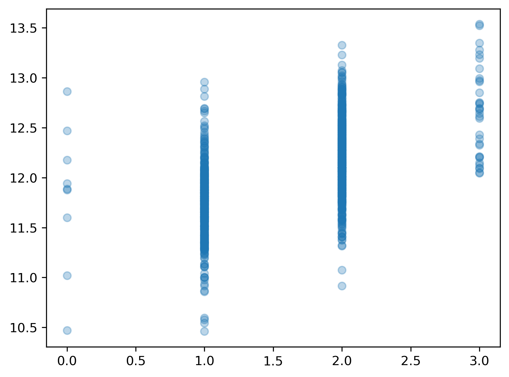

### Intro
With the help of statistical tests and a careful consideration of the phenonemon in study, multivariate regression models can help us test the existence of interesting relationships found in nature. How can we rigorously determine if a regression model is detecting relationships (i.e., non-zero slopes or model coefs) that truly exist?

There are three critical questions we must ask before we can read too far into our model's estimations. We will discuss the first in detail throughout this episode.
1. **Accounting for relevant predictors**: Have we included all relevant predictors in the model?
2. **Regression assumptions**: Does the fitted model follow the 5 assumptions of linear regression?
3. **Bias/variance or under/overfitting**: Does the model capture the variability of the target variable well? Does the model generalize well?

### 1. Relevant predictors

> ## Benefits and drawbacks of including all relevant predcitors
> What do you think might be some benefits of including all relevant predictors in a model that you intend to use to **explain** relationships? Are there any drawbacks you can think of?
> > ## Solution
> >
> > Including all relevant predictor variables in a model is important for several reasons:
> > 
> > 1. **Improving model interpretability**: Leaving out relevant predictors can result in *model misspecification*. Misspecification refers to a situation where the model structure or functional form does not accurately reflect the underlying relationship between the predictors and the outcome. If a relevant predictor is omitted from the model, the coefficients of the remaining predictors may be biased. This occurs because the omitted predictor may have a direct or indirect relationship with the outcome variable, and its effect is not accounted for in the model. Consequently, the estimated coefficients of other predictors may capture some of the omitted predictor's effect, leading to biased estimates.
> > 
> > 2. **Improving predicitive accuracy and reducing residual variance**: Omitting relevant predictors can increase the residual variance in the model. Residual variance represents the unexplained variation in the outcome variable after accounting for the predictors in the model. If a relevant predictor is left out, the model may not fully capture the systematic variation in the data, resulting in larger residuals and reduced model fit. While it is true that, in a research setting, we typically care more about being able to interpret our model than being able to perfectly predict the target variable, a model that severely underfits is still a cause for concern since the model won't be capturing the variability of the data well enough to form any conclusions.
> > 
> > 3. **Robustness to future changes**: This benefit only applies to predictive modeling tasks where models are often being fit to new data. By including all relevant predictors, the model becomes more robust to changes in the data or the underlying system. If a predictor becomes important in the future due to changes in the environment or additional data, including it from the start ensures that the model is already equipped to capture its influence.
> > 
> > **Drawbacks to including all relevant predictors:** While one should always aim to include as many relevant predictors as possible, this goal needs to be balanced with overfitting concerns. If we include too many predictors in the model and train on a limited number of observations, the model may simply memorize the nuances/noise in the data rather than capturing the underlying trend in the data.
> {:.solution}
{:.challenge}


#### Example
Let's consider a regression model where we want to evaluate the relationship between FullBath (number of bathrooms) and SalePrice.


```python
from sklearn.datasets import fetch_openml
housing = fetch_openml(name="house_prices", as_frame=True, parser='auto') #
y=housing['target']
X=housing['data']['FullBath']
X.head()
```


    0    2
    1    2
    2    2
    3    1
    4    2
    Name: FullBath, dtype: int64


It's always a good idea to start by plotting the predictor vs the target variable to get a sense of the underlying relationship.


```python
import matplotlib.pyplot as plt
plt.scatter(X,y,alpha=.3);
# plt.savefig('..//fig//regression//scatterplot_fullBath_vs_salePrice.png', bbox_inches='tight', dpi=300, facecolor='white');
```


Since the relationship doesn't appear to be quite as linear as we were hoping, we will try a log transformation as we did in the previous episode.


```python
import numpy as np
y_log = y.apply(np.log)
plt.scatter(X,y_log, alpha=.3);
plt.savefig('..//fig//regression//scatterplot_fullBath_vs_logSalePrice.png', bbox_inches='tight', dpi=300, facecolor='white');
```




The log transform improves the linear relationship substantially! Next, we will import the statsmodels package which is an R-style modeling package that has some convenient functions for rigorously testing and running stats on linear models.

We'll compare the coefficients estimated from this model to an additional univariate model. To make this comparison more straightforward, we will z-score the predictor. If you don't standardize the scale of all predictors, the coefficient size will be a function of the scale of each specific predictor.


```python
X = (X - X.mean())/X.std()
X.head()
```


    0    0.789470
    1    0.789470
    2    0.789470
    3   -1.025689
    4    0.789470
    Name: FullBath, dtype: float64


```python
import statsmodels.api as sm

# Add a constant column to the predictor variables dataframe
X = sm.add_constant(X)

# Fit the multivariate regression model
model = sm.OLS(y_log, X)
results = model.fit()
print(results.params)
```

    const       12.024051
    FullBath     0.237582
    dtype: float64


The model coefficient estimated for the "FullBath" predictor is 0.24. Recall that we fit this model to a log scaled version of the SalePrice. In other words, increasing the FullBath predictor by 1 standard deviation increases the log(SalePrice) by 0.24. While this explanation is completely valid, it is often useful to interpret the coefficient in terms of the original scale of the target variable.

##### Transforming the coefficient to the original scale of the data.
Exponentiate the coefficient to reverse the log transformation. This gives the multiplicative factor for every one-unit increase in the independent variable. In our model (run code below), for every standard devation increase in the predictor, our target variable increases by a factor of about 1.27, or 27%. Recall that multiplying a number by 1.27 is the same as increasing the number by 27%. Likewise, multiplying a number by, say 0.3, is the same as decreasing the number by 1 – 0.3 = 0.7, or 70%.

<!-- The model coefficient estimated for the "FullBath" predictor is 0.43. Recall that we fit this model to a log scaled version of the SalePrice. In other words, adding an extra bath increases the log(SalePrice) by 0.43. While this explanation is completely valid, it is often useful to interpret the coefficient in terms of the original scale of the target variable.

##### Transforming the coefficient to the original scale of the data.
Exponentiate the coefficient to reverse the log transformation. This gives the multiplicative factor for every one-unit increase in the independent variable. In our model (run code below), for every one-unit increase in the predictor, our target variable increases by a factor of about 1.54, or 54%. Recall that multiplying a number by 1.54 is the same as increasing the number by 54%. Likewise, multiplying a number by, say 0.3, is the same as decreasing the number by 1 – 0.3 = 0.7, or 70%. -->


```python
np.exp(results.params[1]) # First param is the estimated coef for the y-intercept / "const". The second param is the estimated coef for FullBath.
```


    1.2681792421553824


When transformed to the original data scale, this coefficient tells us that increasing bathroom count by 1 standard deviation increases the sale price, on average, by 27%. While bathrooms are a very hot commodity to find in a house, they likely don't deserve this much credit. Let's do some further digging by comparing another predictor which likely has a large impact on SalePrice — the total square footage of the house (excluding the basement).


```python
X=housing['data']['GrLivArea']
plt.scatter(X, y_log);
```


As before,, we will z-score the predictor. This is a critical step when comparing coefficient estimates since the estimates are a function of the scale of the predictor.


```python
X = (X - X.mean())/X.std()
X.head()
```


    0    0.370207
    1   -0.482347
    2    0.514836
    3    0.383528
    4    1.298881
    Name: GrLivArea, dtype: float64


Fit the model.


```python
# Add a constant column to the predictor variables dataframe
X = sm.add_constant(X)
print(X.head())
# Fit the multivariate regression model
model = sm.OLS(y_log, X)
results = model.fit()
results.params
```

       const  GrLivArea
    0    1.0   0.370207
    1    1.0  -0.482347
    2    1.0   0.514836
    3    1.0   0.383528
    4    1.0   1.298881


    const        12.024051
    GrLivArea     0.279986
    dtype: float64


```python
np.exp(results.params[1]) # First param is the estimated coef for the y-intercept / "const". The second param is the estimated coef for FullBath.
```


    1.3231118984358705


For every one standard devation increase in the predictor (GrLivArea), our target variable (SalePrice) increases by a factor of about 1.32, or 32%.

Let's compare our findings with a multivariate regression model that includes both predictors.


```python
predictors = ['GrLivArea', 'FullBath']
X=housing['data'][predictors]
X.head()
```


<div>
<style scoped>
    .dataframe tbody tr th:only-of-type {
        vertical-align: middle;
    }

    .dataframe tbody tr th {
        vertical-align: top;
    }

    .dataframe thead th {
        text-align: right;
    }
</style>
<table border="1" class="dataframe">
  <thead>
    <tr style="text-align: right;">
      <th></th>
      <th>GrLivArea</th>
      <th>FullBath</th>
    </tr>
  </thead>
  <tbody>
    <tr>
      <th>0</th>
      <td>1710</td>
      <td>2</td>
    </tr>
    <tr>
      <th>1</th>
      <td>1262</td>
      <td>2</td>
    </tr>
    <tr>
      <th>2</th>
      <td>1786</td>
      <td>2</td>
    </tr>
    <tr>
      <th>3</th>
      <td>1717</td>
      <td>1</td>
    </tr>
    <tr>
      <th>4</th>
      <td>2198</td>
      <td>2</td>
    </tr>
  </tbody>
</table>
</div>


##### Standardization
when working with multiple predictors, it's essential to zscore all predictors so that you can compare coefficient estimates across predictors. If you don't standardize the scale of all predictors, the coefficient size will be a function of the scale of each specific predictor.


```python
X = (X - X.mean())/X.std()
X.head()
```


<div>
<style scoped>
    .dataframe tbody tr th:only-of-type {
        vertical-align: middle;
    }

    .dataframe tbody tr th {
        vertical-align: top;
    }

    .dataframe thead th {
        text-align: right;
    }
</style>
<table border="1" class="dataframe">
  <thead>
    <tr style="text-align: right;">
      <th></th>
      <th>GrLivArea</th>
      <th>FullBath</th>
    </tr>
  </thead>
  <tbody>
    <tr>
      <th>0</th>
      <td>0.370207</td>
      <td>0.789470</td>
    </tr>
    <tr>
      <th>1</th>
      <td>-0.482347</td>
      <td>0.789470</td>
    </tr>
    <tr>
      <th>2</th>
      <td>0.514836</td>
      <td>0.789470</td>
    </tr>
    <tr>
      <th>3</th>
      <td>0.383528</td>
      <td>-1.025689</td>
    </tr>
    <tr>
      <th>4</th>
      <td>1.298881</td>
      <td>0.789470</td>
    </tr>
  </tbody>
</table>
</div>


Add constant for modeling y-intercept


```python
# Fit the multivariate regression model
X = sm.add_constant(X)
X.head()
```


<div>
<style scoped>
    .dataframe tbody tr th:only-of-type {
        vertical-align: middle;
    }

    .dataframe tbody tr th {
        vertical-align: top;
    }

    .dataframe thead th {
        text-align: right;
    }
</style>
<table border="1" class="dataframe">
  <thead>
    <tr style="text-align: right;">
      <th></th>
      <th>const</th>
      <th>GrLivArea</th>
      <th>FullBath</th>
    </tr>
  </thead>
  <tbody>
    <tr>
      <th>0</th>
      <td>1.0</td>
      <td>0.370207</td>
      <td>0.789470</td>
    </tr>
    <tr>
      <th>1</th>
      <td>1.0</td>
      <td>-0.482347</td>
      <td>0.789470</td>
    </tr>
    <tr>
      <th>2</th>
      <td>1.0</td>
      <td>0.514836</td>
      <td>0.789470</td>
    </tr>
    <tr>
      <th>3</th>
      <td>1.0</td>
      <td>0.383528</td>
      <td>-1.025689</td>
    </tr>
    <tr>
      <th>4</th>
      <td>1.0</td>
      <td>1.298881</td>
      <td>0.789470</td>
    </tr>
  </tbody>
</table>
</div>


```python
model = sm.OLS(y_log, X)
results = model.fit()
print(results.params)

```

    const        12.024051
    GrLivArea     0.216067
    FullBath      0.101457
    dtype: float64


Let's convert these measures to the original scale of the target variable as we did before.


```python
print('GrLivArea:', np.exp(.216))
print('FullBath:', np.exp(.101))
```

    GrLivArea: 1.2411023790006717
    FullBath: 1.1062766417634236

test4
> ## Example4
> Convert the coefficients to the original scale of the target variable as we did earlier in this episode. How much does SalePrice increase with a 1 standard deviation increase in each predictor?
> How do these estimates compare to the univariate model estimates? Is there any difference? If so, what might be the cause?
> > ## Solution
> > 
> > Including all relevant predictor variables in a model is important for several reasons:
> > 
> > **Improving model interpretability**: Leaving out relevant predictors can result in *model misspecification*. Misspecification refers to a situation where the model structure or functional form does not accurately reflect the underlying relationship between the predictors and the outcome. If a relevant predictor is omitted from the model, the coefficients of the remaining predictors may be biased. This occurs because the omitted predictor may have a direct or indirect relationship with the outcome variable, and its effect is not accounted for in the model. Consequently, the estimated coefficients of other predictors may capture some of the omitted predictor's effect, leading to biased estimates.
> >
> > **Improving predicitive accuracy and reducing residual variance**: Omitting relevant predictors can increase the residual variance in the model. Residual variance represents the unexplained variation in the outcome variable after accounting for the predictors in the model. If a relevant predictor is left out, the model may not fully capture the systematic variation in the data, resulting in larger residuals and reduced model fit. While it is true that, in a research setting, we typically care more about being able to interpret our model than being able to perfectly predict the target variable, a model that severely underfits is still a cause for concern since the model won't be capturing the variability of the data well enough to form any conclusions.
> >
> > **Robustness to future changes**: This benefit only applies to predictive modeling tasks where models are often being fit to new data. By including all relevant predictors, the model becomes more robust to changes in the data or the underlying system. If a predictor becomes important in the future due to changes in the environment or additional data, including it from the start ensures that the model is already equipped to capture its influence.
> > 
> > **Drawbacks to including all relevant predictors:** While one should always aim to include as many relevant predictors as possible, this goal needs to be balanced with overfitting concerns. If we include too many predictors in the model and train on a limited number of observations, the model may simply memorize the nuances/noise in the data rather than capturing the underlying trend in the data.
> > 
> {:.solution}
{:.challenge}


> ## Example3
> 1. Convert the coefficients to the original scale of the target variable as we did earlier in this episode. How much does SalePrice increase with a 1 standard deviation increase in each predictor?
> 2. How do these estimates compare to the univariate model estimates? Is there any difference? If so, what might be the cause?
> > ## Solution
> > 
> > Including all relevant predictor variables in a model is important for several reasons:
> > 
> > 1. **Improving model interpretability**: Leaving out relevant predictors can result in *model misspecification*. Misspecification refers to a situation where the model structure or functional form does not accurately reflect the underlying relationship between the predictors and the outcome. If a relevant predictor is omitted from the model, the coefficients of the remaining predictors may be biased. This occurs because the omitted predictor may have a direct or indirect relationship with the outcome variable, and its effect is not accounted for in the model. Consequently, the estimated coefficients of other predictors may capture some of the omitted predictor's effect, leading to biased estimates.
> > 
> > 2. **Improving predicitive accuracy and reducing residual variance**: Omitting relevant predictors can increase the residual variance in the model. Residual variance represents the unexplained variation in the outcome variable after accounting for the predictors in the model. If a relevant predictor is left out, the model may not fully capture the systematic variation in the data, resulting in larger residuals and reduced model fit. While it is true that, in a research setting, we typically care more about being able to interpret our model than being able to perfectly predict the target variable, a model that severely underfits is still a cause for concern since the model won't be capturing the variability of the data well enough to form any conclusions.
> > 
> > 3. **Robustness to future changes**: This benefit only applies to predictive modeling tasks where models are often being fit to new data. By including all relevant predictors, the model becomes more robust to changes in the data or the underlying system. If a predictor becomes important in the future due to changes in the environment or additional data, including it from the start ensures that the model is already equipped to capture its influence.
> > 
> > **Drawbacks to including all relevant predictors:** While one should always aim to include as many relevant predictors as possible, this goal needs to be balanced with overfitting concerns. If we include too many predictors in the model and train on a limited number of observations, the model may simply memorize the nuances/noise in the data rather than capturing the underlying trend in the data.
> > 
> {:.solution}
{:.challenge}


> ## Example2
> Convert the coefficients to the original scale of the target variable as we did earlier in this episode. How much does SalePrice increase with a 1 standard deviation increase in each predictor?
> How do these estimates compare to the univariate model estimates? Is there any difference? If so, what might be the cause?
> > ## Solution
> > 
> > Including all relevant predictor variables in a model is important for several reasons:
> > 
> > 1. **Improving model interpretability**: Leaving out relevant predictors can result in *model misspecification*. Misspecification refers to a situation where the model structure or functional form does not accurately reflect the underlying relationship between the predictors and the outcome. If a relevant predictor is omitted from the model, the coefficients of the remaining predictors may be biased. This occurs because the omitted predictor may have a direct or indirect relationship with the outcome variable, and its effect is not accounted for in the model. Consequently, the estimated coefficients of other predictors may capture some of the omitted predictor's effect, leading to biased estimates.
> > 
> > 2. **Improving predicitive accuracy and reducing residual variance**: Omitting relevant predictors can increase the residual variance in the model. Residual variance represents the unexplained variation in the outcome variable after accounting for the predictors in the model. If a relevant predictor is left out, the model may not fully capture the systematic variation in the data, resulting in larger residuals and reduced model fit. While it is true that, in a research setting, we typically care more about being able to interpret our model than being able to perfectly predict the target variable, a model that severely underfits is still a cause for concern since the model won't be capturing the variability of the data well enough to form any conclusions.
> > 
> > 3. **Robustness to future changes**: This benefit only applies to predictive modeling tasks where models are often being fit to new data. By including all relevant predictors, the model becomes more robust to changes in the data or the underlying system. If a predictor becomes important in the future due to changes in the environment or additional data, including it from the start ensures that the model is already equipped to capture its influence.
> > 
> > **Drawbacks to including all relevant predictors:** While one should always aim to include as many relevant predictors as possible, this goal needs to be balanced with overfitting concerns. If we include too many predictors in the model and train on a limited number of observations, the model may simply memorize the nuances/noise in the data rather than capturing the underlying trend in the data.
> {:.solution}
{:.challenge}

> ## Example1
> - Convert the coefficients to the original scale of the target variable as we did earlier in this episode. How much does SalePrice increase with a 1 standard deviation increase in each predictor?
> - How do these estimates compare to the univariate model estimates? Is there any difference? If so, what might be the cause?
> > ## Solution
> > 
> > Including all relevant predictor variables in a model is important for several reasons:
> > 
> > 1. **Improving model interpretability**: Leaving out relevant predictors can result in *model misspecification*. Misspecification refers to a situation where the model structure or functional form does not accurately reflect the underlying relationship between the predictors and the outcome. If a relevant predictor is omitted from the model, the coefficients of the remaining predictors may be biased. This occurs because the omitted predictor may have a direct or indirect relationship with the outcome variable, and its effect is not accounted for in the model. Consequently, the estimated coefficients of other predictors may capture some of the omitted predictor's effect, leading to biased estimates.
> > 
> > 2. **Improving predicitive accuracy and reducing residual variance**: Omitting relevant predictors can increase the residual variance in the model. Residual variance represents the unexplained variation in the outcome variable after accounting for the predictors in the model. If a relevant predictor is left out, the model may not fully capture the systematic variation in the data, resulting in larger residuals and reduced model fit. While it is true that, in a research setting, we typically care more about being able to interpret our model than being able to perfectly predict the target variable, a model that severely underfits is still a cause for concern since the model won't be capturing the variability of the data well enough to form any conclusions.
> > 
> > 3. **Robustness to future changes**: This benefit only applies to predictive modeling tasks where models are often being fit to new data. By including all relevant predictors, the model becomes more robust to changes in the data or the underlying system. If a predictor becomes important in the future due to changes in the environment or additional data, including it from the start ensures that the model is already equipped to capture its influence.
> > 
> > **Drawbacks to including all relevant predictors:** While one should always aim to include as many relevant predictors as possible, this goal needs to be balanced with overfitting concerns. If we include too many predictors in the model and train on a limited number of observations, the model may simply memorize the nuances/noise in the data rather than capturing the underlying trend in the data.
> {:.solution}
{:.challenge}

> ## Comparing results
> 1. Convert the coefficients to the original scale of the target variable as we did earlier in this episode. How much does SalePrice increase with a 1 standard deviation increase in each predictor?
> 2. How do these estimates compare to the univariate model estimates? Is there any difference? If so, what might be the cause?
> > ## Solution
> > 
> > Including all relevant predictor variables in a model is important for several reasons:
> > 
> > 1. **Improving model interpretability**: Leaving out relevant predictors can result in *model misspecification*. Misspecification refers to a situation where the model structure or functional form does not accurately reflect the underlying relationship between the predictors and the outcome. If a relevant predictor is omitted from the model, the coefficients of the remaining predictors may be biased. This occurs because the omitted predictor may have a direct or indirect relationship with the outcome variable, and its effect is not accounted for in the model. Consequently, the estimated coefficients of other predictors may capture some of the omitted predictor's effect, leading to biased estimates.
> > 
> > 2. **Improving predicitive accuracy and reducing residual variance**: Omitting relevant predictors can increase the residual variance in the model. Residual variance represents the unexplained variation in the outcome variable after accounting for the predictors in the model. If a relevant predictor is left out, the model may not fully capture the systematic variation in the data, resulting in larger residuals and reduced model fit. While it is true that, in a research setting, we typically care more about being able to interpret our model than being able to perfectly predict the target variable, a model that severely underfits is still a cause for concern since the model won't be capturing the variability of the data well enough to form any conclusions.
> > 
> > 3. **Robustness to future changes**: This benefit only applies to predictive modeling tasks where models are often being fit to new data. By including all relevant predictors, the model becomes more robust to changes in the data or the underlying system. If a predictor becomes important in the future due to changes in the environment or additional data, including it from the start ensures that the model is already equipped to capture its influence.
> > 
> > **Drawbacks to including all relevant predictors:** While one should always aim to include as many relevant predictors as possible, this goal needs to be balanced with overfitting concerns. If we include too many predictors in the model and train on a limited number of observations, the model may simply memorize the nuances/noise in the data rather than capturing the underlying trend in the data.
> {:.solution}
{:.challenge}


Without the "Number of Bedrooms" predictor, the model will fail to capture the effect of the number of bedrooms on the house price. This can result in biased coefficient estimates for the remaining predictor, "Square Footage."

In reality, the number of bedrooms has a positive relationship with the house price, as houses with more bedrooms tend to be larger and more desirable. However, since we omitted the "Number of Bedrooms" predictor, the model mistakenly attributes the effect of the number of bedrooms to the "Square Footage" predictor.

As a result, the coefficient estimate for "Square Footage" might be inflated. The model might incorrectly assign a higher coefficient to "Square Footage" to compensate for the omitted effect of the number of bedrooms. This bias arises because the model fails to account for the contribution of the "Number of Bedrooms" predictor, which is relevant and correlated with the outcome variable.

By leaving out the relevant predictor, we introduce bias into the coefficient estimates of the remaining predictors, leading to inaccurate and misleading interpretations of their effects on the outcome variable.

In the multivariate model, we


```python
from statsmodels.stats.outliers_influence import variance_inflation_factor
import pandas as pd
# Calculate VIF for each predictor in X
vif = pd.DataFrame()
vif["Variable"] = X.columns
vif["VIF"] = [variance_inflation_factor(X.values, i) for i in range(X.shape[1])]

# Display the VIF values
print(vif)
```

        Variable      VIF
    0  GrLivArea  1.65814
    1   FullBath  1.65814


```python
plt.hist(X['BedroomAbvGr'])
```

