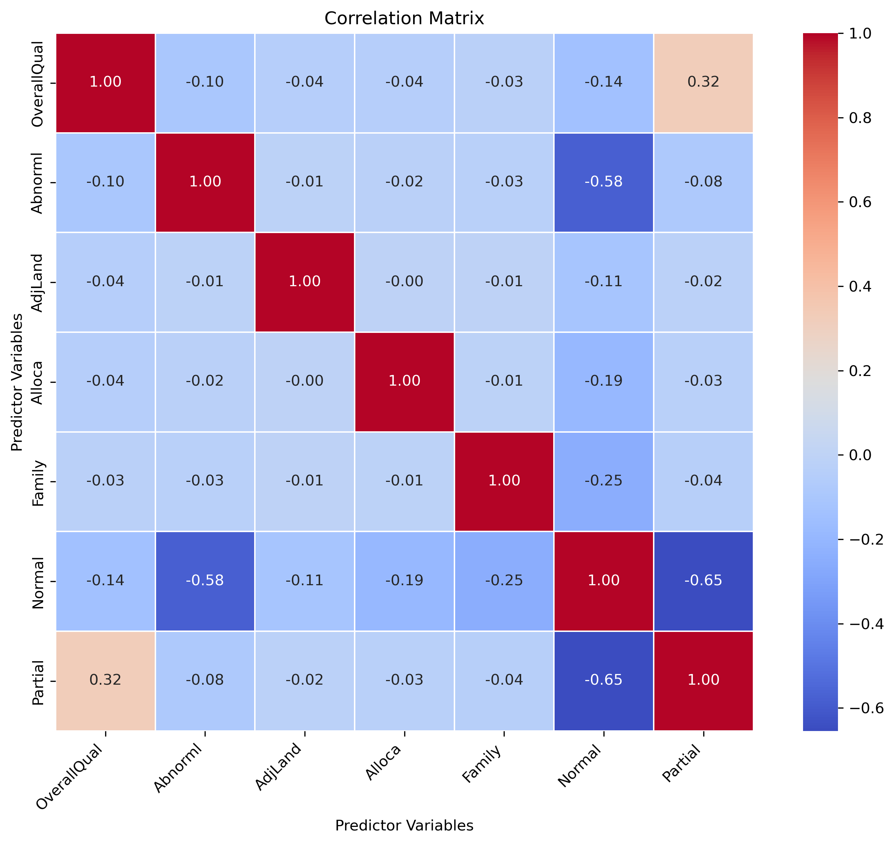
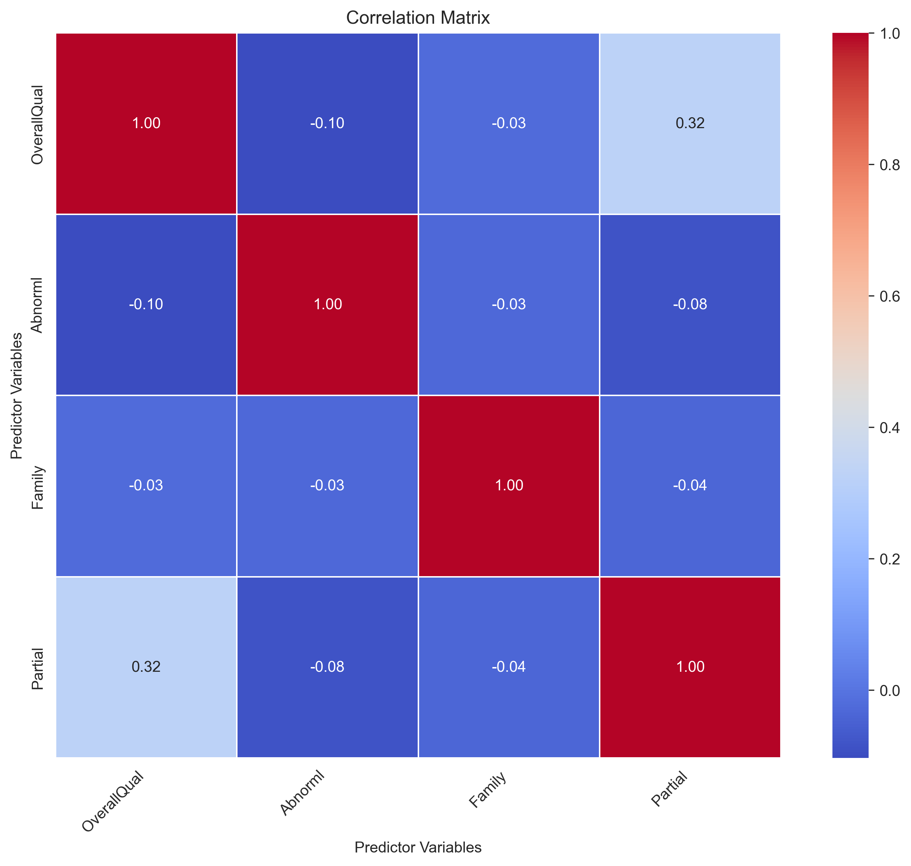
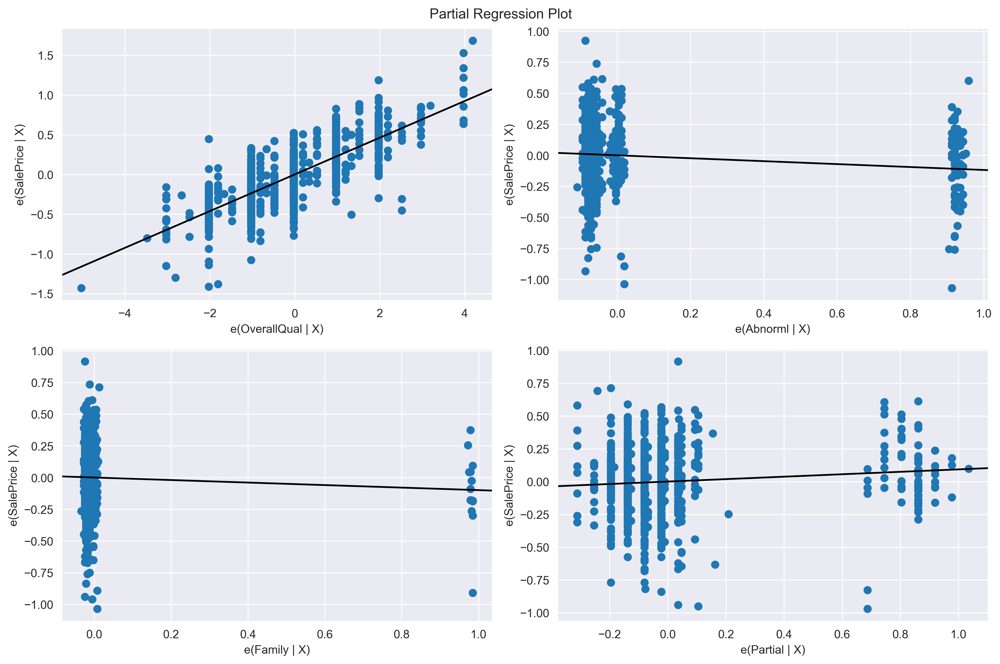
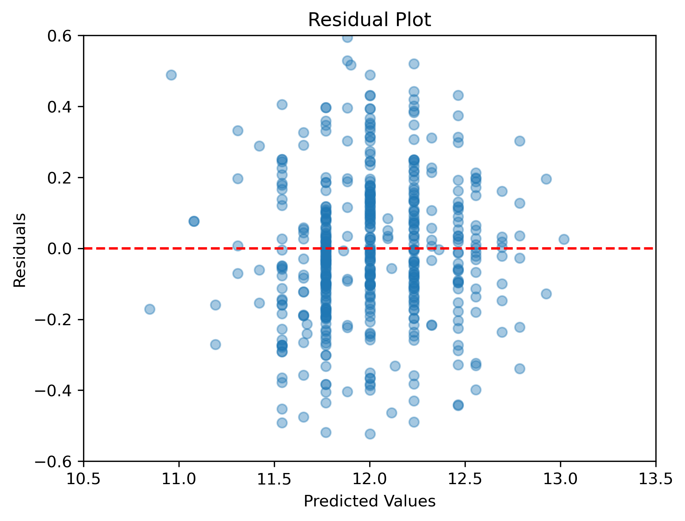
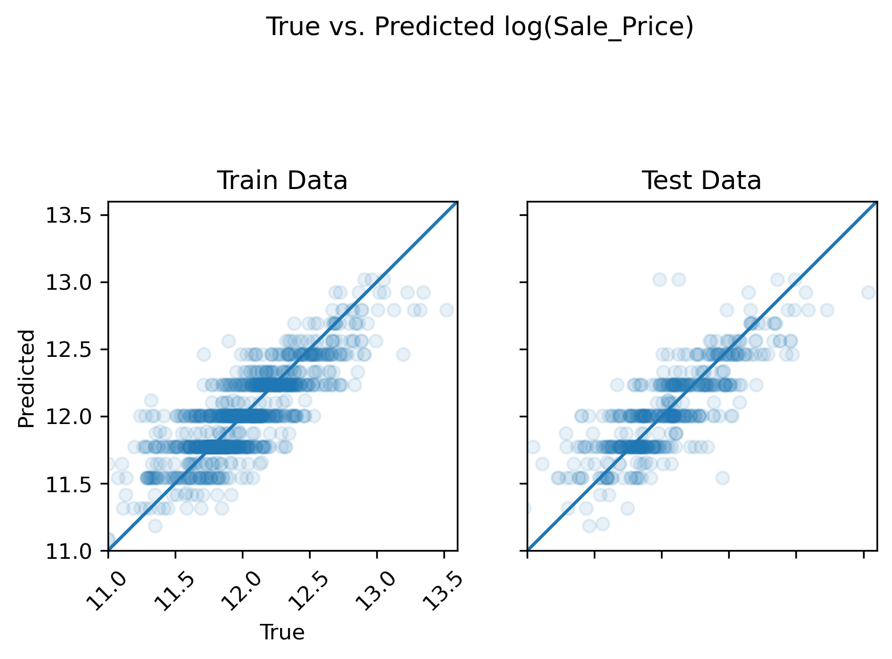

### Intro
With the help of statistical tests and a careful consideration of the phenonemon in study, multivariate regression models can help us test the existence of interesting relationships found in nature. How can we rigorously determine if a regression model is detecting relationships (i.e., non-zero slopes or model coefs) that truly exist? 

There are three critical questions we must ask before we can read too far into our model's estimations. We will discuss all three in detail throughout this episode.
1. **Accounting for relevant predictors**: Have we included as many relevant predictors in the model as possible?
2. **Bias/variance or under/overfitting**: Does the model capture the variability of the target variable well? Does the model generalize well?
3. **Regression assumptions**: Does the fitted model follow the 5 assumptions of linear regression?

### 2. Regression assumptions and hypothesis testing
What does it mean to be statistically signficiant? It means that an observed relationship is unlikely (< 5% chance if p=.005) to occur due to chance alone. 

To run statistics on a regression model, we start with two hypotheses — one null and one alternative.
* $H_0$ (Null hypothesis): $m$ = 0 (i.e., slope is flat)
* $H_A$ (Alternative hypothesis): $m \neq 0$ (i.e.., slope is not completely flat) 

In other words, we are testing to see if a predictor has a consistent effect on some target variable. We are NOT testing the magnitidute of the effect (we will discuss effect sizes later); simply whether or not an observed effect is due to chance or not. In statistics, we start with the null hypothesis as our default and review evidence (the fitted model and its estimated parameters and error measurement) to see if the observed data suggests that the null hypothesis should be rejected.

#### Linear regression assumptions
The assumptions of regression (mostly) need to be met before rejecting the null hypothesis because violating these assumptions can lead to biased and unreliable parameter estimates, incorrect standard errors, and misleading hypothesis test results. Failing to meet the assumptions can compromise the validity and interpretability of the regression model. When testing multivariate models for signficant coefficients, the following assumpitons should be met to assure validty of results.
1. **Linearity**: There is a linear relation between Y and X
2. **Normality**: The error terms (residuals) are normally distributed
3. **Homoscedasticity**: The variance of the error terms is constant over all X values (homoscedasticity)
4. **Independence**: The error terms are independent
5. **Limited multicollinearity among predictors**: This assumption applies to multivariate regression models but is not relevant in univariate regression since there is only one predictor variable. Multicollinearity refers to the presence of high correlation or linear dependence among the predictor variables in a regression model. It indicates that there is a strong linear relationship between two or more predictor variables. Multicollinearity can make it challenging to isolate the individual effects of predictors and can lead to unstable and unreliable coefficient estimates. It primarily focuses on the relationships among the predictors themselves. 

#### Testing procedure
The procedure for testing whether predictor(s) have a statistically significant effect on a target variable in a regression model typically involves the following steps:

1. Formulate the null hypothesis (H₀) and alternative hypothesis (H₁) for the test. The null hypothesis typically states that the predictor has no effect on the response variable (coef=0), while the alternative hypothesis suggests that there is a significant effect (coef!=0).

2. If using multiple predictors, check for multicollinearity. Multicollinearity can be an especially pervasive.

3. Fit the regression model to your data. Obtain the estimated coefficients for each predictor, along with their standard errors.

4. Evaluate linearity assumption (if using univariate model, can do this step before model fitting via a simple scatterplot).

5. Evaluate normality of errors assumption

6. Calculate the test statistic: Calculate the test statistic based on the estimated coefficient and its standard error. The test statistic depends on the specific regression model and hypothesis being tested. Common test statistics include t-statistic, z-statistic, or F-statistic.

6. Determine the critical value: Determine the critical value or significance level (α) at which you want to test the hypothesis. The significance level typically ranges from 0.01 to 0.05, depending on the desired level of confidence.

7. Compare the test statistic and critical value: Compare the calculated test statistic with the critical value. If the test statistic falls within the critical region (i.e., the calculated p-value is less than the significance level), you reject the null hypothesis and conclude that the predictor is statistically significant. If the test statistic does not fall within the critical region, you fail to reject the null hypothesis, indicating that the predictor is not statistically significant.

8. Interpret the results: Based on the conclusion from the hypothesis test, interpret the significance of the predictor. If the predictor is deemed statistically significant, it suggests that there is evidence of a relationship between the predictor and the response variable. If the predictor is not statistically significant, it implies that there is no significant evidence of an effect.

It's important to note that significance tests provide statistical evidence for or against the null hypothesis, but they should be interpreted alongside other factors such as effect size, practical significance, and the context of the problem being studied. Additionally, it's crucial to consider the assumptions and limitations of the regression model and the underlying data when interpreting the model.

### 0. Load and prep data
For this episode, we'll explore how to rigorously evaluate the statistics of a multivarite regression model.


```python
from sklearn.datasets import fetch_openml
housing = fetch_openml(name="house_prices", as_frame=True, parser='auto') #
```

Let's assume we have two predictors recorded in this dataset — sale condition and OverallQual. What values can the sale condition variable take?


```python
y=housing['target']
cat_predictor = 'SaleCondition'#'SaleType'#'Heating' #  SaleCondition
predictors = ['OverallQual', cat_predictor]#'YrSold']#, 'GrLivArea', 'GarageCars', 'GarageArea', 'TotalBsmtSF']
X=housing['data'][predictors]
print(X.head())
print(X[cat_predictor].unique())
```

       OverallQual SaleCondition
    0            7        Normal
    1            6        Normal
    2            7        Normal
    3            7       Abnorml
    4            8        Normal
    ['Normal' 'Abnorml' 'Partial' 'AdjLand' 'Alloca' 'Family']
    


```python
with open('Ames_data_readme.txt', 'w') as f:
    f.write(housing.DESCR)
```

SaleCondition: Condition of sale

       Normal	Normal Sale
       Abnorml	Abnormal Sale -  trade, foreclosure, short sale
       AdjLand	Adjoining Land Purchase
       Alloca	Allocation - two linked properties with separate deeds, typically condo with a garage unit	
       Family	Sale between family members
       Partial	Home was not completed when last assessed (associated with New Homes)
Heating: Type of heating
		
       Floor	Floor Furnace
       GasA	Gas forced warm air furnace
       GasW	Gas hot water or steam heat
       Grav	Gravity furnace	
       OthW	Hot water or steam heat other than gas
       Wall	Wall furnace

#### Encode categorical data as multiple binary predictors


```python
import pandas as pd
# one-hot encoding
# Get one hot encoding of columns B
one_hot = pd.get_dummies(X[cat_predictor])
one_hot.head()
```


<div>
<style scoped>
    .dataframe tbody tr th:only-of-type {
        vertical-align: middle;
    }

    .dataframe tbody tr th {
        vertical-align: top;
    }

    .dataframe thead th {
        text-align: right;
    }
</style>
<table border="1" class="dataframe">
  <thead>
    <tr style="text-align: right;">
      <th></th>
      <th>Abnorml</th>
      <th>AdjLand</th>
      <th>Alloca</th>
      <th>Family</th>
      <th>Normal</th>
      <th>Partial</th>
    </tr>
  </thead>
  <tbody>
    <tr>
      <th>0</th>
      <td>0</td>
      <td>0</td>
      <td>0</td>
      <td>0</td>
      <td>1</td>
      <td>0</td>
    </tr>
    <tr>
      <th>1</th>
      <td>0</td>
      <td>0</td>
      <td>0</td>
      <td>0</td>
      <td>1</td>
      <td>0</td>
    </tr>
    <tr>
      <th>2</th>
      <td>0</td>
      <td>0</td>
      <td>0</td>
      <td>0</td>
      <td>1</td>
      <td>0</td>
    </tr>
    <tr>
      <th>3</th>
      <td>1</td>
      <td>0</td>
      <td>0</td>
      <td>0</td>
      <td>0</td>
      <td>0</td>
    </tr>
    <tr>
      <th>4</th>
      <td>0</td>
      <td>0</td>
      <td>0</td>
      <td>0</td>
      <td>1</td>
      <td>0</td>
    </tr>
  </tbody>
</table>
</div>


#### Handling sparse binary predictors
After we've split our category variable into 6 binary predictors, it is important to assess the quantity of information present in each predictor. If a predictor shows very little variability (e.g., nearly all 0's or 1's in a binary variable), then it will be challenging to detect a meaningful relationship between that predictor and the target. The model needs to observe examples from both classes of a binary variable in order to reveal a measurable effect between a binary variable and the target.

To assess the degree or sparsity in each binary predictor, we'll calculate the count and total percentage of observations where a 1 occurs.


```python
print(one_hot.sum())
print(one_hot.sum()/one_hot.shape[0]*100)
```

    Abnorml     101
    AdjLand       4
    Alloca       12
    Family       20
    Normal     1198
    Partial     125
    dtype: int64
    Abnorml     6.917808
    AdjLand     0.273973
    Alloca      0.821918
    Family      1.369863
    Normal     82.054795
    Partial     8.561644
    dtype: float64
    

A few of the predictors (AdjLand, Alloca, Family) contain very little information since they are filled almost entirely with 0's. With few observations to rely on, this makes it difficult to assess how house price changes when these predictors become active (1 instead of 0). If you encounter extremely sparse predictors, it's best to remove them from the start to avoid wasting computational resources. You can use a percentage threshold or a total count threshold to refine the list of viable/studyable predictors. Here, we'll remove predictors that don't have at least 20 observations. The exact threshold chosen is somewhat arbitrary. It's more important that you follow-up this choice with a thorough investigation of the resulting model and adjust the model downstream, if necessary.


```python
one_hot = one_hot.drop(['AdjLand', 'Alloca'], axis = 1)
one_hot.head()
```


<div>
<style scoped>
    .dataframe tbody tr th:only-of-type {
        vertical-align: middle;
    }

    .dataframe tbody tr th {
        vertical-align: top;
    }

    .dataframe thead th {
        text-align: right;
    }
</style>
<table border="1" class="dataframe">
  <thead>
    <tr style="text-align: right;">
      <th></th>
      <th>Abnorml</th>
      <th>Family</th>
      <th>Normal</th>
      <th>Partial</th>
    </tr>
  </thead>
  <tbody>
    <tr>
      <th>0</th>
      <td>0</td>
      <td>0</td>
      <td>1</td>
      <td>0</td>
    </tr>
    <tr>
      <th>1</th>
      <td>0</td>
      <td>0</td>
      <td>1</td>
      <td>0</td>
    </tr>
    <tr>
      <th>2</th>
      <td>0</td>
      <td>0</td>
      <td>1</td>
      <td>0</td>
    </tr>
    <tr>
      <th>3</th>
      <td>1</td>
      <td>0</td>
      <td>0</td>
      <td>0</td>
    </tr>
    <tr>
      <th>4</th>
      <td>0</td>
      <td>0</td>
      <td>1</td>
      <td>0</td>
    </tr>
  </tbody>
</table>
</div>


```python
X.head()
```


<div>
<style scoped>
    .dataframe tbody tr th:only-of-type {
        vertical-align: middle;
    }

    .dataframe tbody tr th {
        vertical-align: top;
    }

    .dataframe thead th {
        text-align: right;
    }
</style>
<table border="1" class="dataframe">
  <thead>
    <tr style="text-align: right;">
      <th></th>
      <th>OverallQual</th>
      <th>SaleCondition</th>
    </tr>
  </thead>
  <tbody>
    <tr>
      <th>0</th>
      <td>7</td>
      <td>Normal</td>
    </tr>
    <tr>
      <th>1</th>
      <td>6</td>
      <td>Normal</td>
    </tr>
    <tr>
      <th>2</th>
      <td>7</td>
      <td>Normal</td>
    </tr>
    <tr>
      <th>3</th>
      <td>7</td>
      <td>Abnorml</td>
    </tr>
    <tr>
      <th>4</th>
      <td>8</td>
      <td>Normal</td>
    </tr>
  </tbody>
</table>
</div>


```python
# Drop column SaleCondition as it is now encoded
X = X.drop(cat_predictor,axis = 1)
X.head()
```


<div>
<style scoped>
    .dataframe tbody tr th:only-of-type {
        vertical-align: middle;
    }

    .dataframe tbody tr th {
        vertical-align: top;
    }

    .dataframe thead th {
        text-align: right;
    }
</style>
<table border="1" class="dataframe">
  <thead>
    <tr style="text-align: right;">
      <th></th>
      <th>OverallQual</th>
    </tr>
  </thead>
  <tbody>
    <tr>
      <th>0</th>
      <td>7</td>
    </tr>
    <tr>
      <th>1</th>
      <td>6</td>
    </tr>
    <tr>
      <th>2</th>
      <td>7</td>
    </tr>
    <tr>
      <th>3</th>
      <td>7</td>
    </tr>
    <tr>
      <th>4</th>
      <td>8</td>
    </tr>
  </tbody>
</table>
</div>


```python
# Join the encoded df
X = X.join(one_hot)
X.head()
```


<div>
<style scoped>
    .dataframe tbody tr th:only-of-type {
        vertical-align: middle;
    }

    .dataframe tbody tr th {
        vertical-align: top;
    }

    .dataframe thead th {
        text-align: right;
    }
</style>
<table border="1" class="dataframe">
  <thead>
    <tr style="text-align: right;">
      <th></th>
      <th>OverallQual</th>
      <th>Abnorml</th>
      <th>Family</th>
      <th>Normal</th>
      <th>Partial</th>
    </tr>
  </thead>
  <tbody>
    <tr>
      <th>0</th>
      <td>7</td>
      <td>0</td>
      <td>0</td>
      <td>1</td>
      <td>0</td>
    </tr>
    <tr>
      <th>1</th>
      <td>6</td>
      <td>0</td>
      <td>0</td>
      <td>1</td>
      <td>0</td>
    </tr>
    <tr>
      <th>2</th>
      <td>7</td>
      <td>0</td>
      <td>0</td>
      <td>1</td>
      <td>0</td>
    </tr>
    <tr>
      <th>3</th>
      <td>7</td>
      <td>1</td>
      <td>0</td>
      <td>0</td>
      <td>0</td>
    </tr>
    <tr>
      <th>4</th>
      <td>8</td>
      <td>0</td>
      <td>0</td>
      <td>1</td>
      <td>0</td>
    </tr>
  </tbody>
</table>
</div>


### 1. Specify hypotheses
We begin by formulating the null hypothesis (H₀) and alternative hypothesis (H₁) for each predictor we intend to include in the model. The null hypothesis states that the predictor has no effect on the response variable, while the alternative hypothesis suggests that there is a significant effect (typically < 5% chance of observing the relationship by chance alone). Before we can reject the null hypothesis, we must make sure to satisfy all multivariate regression assumptions to ensure reliable and valid inference.

### 2. Check for multicollinearity 

In statistics, multicollinearity is a phenomenon in which one or more predictors in a multivariate regression model can be linearly predicted from the others with a substantial degree of accuracy. In other words, it means that one or more predictors are highly correlated with one another.

Multicollinearity presents a problem in multivariate regression because, without having independent/uncorrelated predictors, it is difficult to know how much each predictor truly contributes to predicting the target variable. In other words, when two or more predictors are closely related or measure almost the same thing, then the underlying impact on the target varible is being accounted for twice (or more) across the predictors.

While multicollinearity does not reduce a model's overall predictive power, it can produce estimates of the regression coefficients that are not statistically valid.

#### Variance Inflation Factor (VIF) 
The VIF (Variance Inflation Factor) is a statistical measure used to detect multicollinearity in regression analysis. VIF helps to quantify the extent to which multicollinearity is present in the model.

The intuition behind the VIF score is based on the idea that if two or more predictor variables are highly correlated, it becomes difficult for the model to distinguish the individual effects of these variables on the dependent variable. Consequently, the coefficient estimates for these variables become unstable, and their standard errors become inflated, making the results less reliable.

The VIF is calculated for each independent variable in the regression model. Specifically, to calculate the VIF for predictor i, the following steps are taken:

* Fit a regression model with variable i as the dependent variable and all other independent variables (excluding i) as predictors.

* Calculate the R-squared value (R²) for this regression model. R² represents the proportion of variance in variable i that can be explained by the other independent variables.

* Calculate the VIF for variable i using the formula: VIF(i) = 1 / (1 - R²)

* The interpretation of the VIF score is as follows:

    * A VIF of 1 indicates that there is no multicollinearity for the variable, meaning it is not correlated with any other independent variable in the model.

    * VIF values between 1 and 5 generally indicate low to moderate multicollinearity, which is typically considered acceptable in most cases.

    * VIF values greater than 5 (some sources use a threshold of 10) suggest high multicollinearity, indicating that the variable is highly correlated with other independent variables, and its coefficient estimates may be unreliable.

    * In extreme cases, VIF can take on very high values, approaching infinity, indicating an almost perfect linear relationship between the variable and other predictors in the model.


```python
from statsmodels.stats.outliers_influence import variance_inflation_factor

def calc_print_VIF(X):
    # Calculate VIF for each predictor in X
    vif = pd.DataFrame()
    vif["Variable"] = X.columns
    vif["VIF"] = [variance_inflation_factor(X.values, i) for i in range(X.shape[1])]

    # Display the VIF values
    print(vif)
```


```python
calc_print_VIF(X)
```

          Variable        VIF
    0  OverallQual  19.518808
    1      Abnorml   2.072691
    2       Family   1.229967
    3       Normal  15.774223
    4      Partial   3.441928
    

It looks like two of the predictors, "Normal" and "OverallQual", hvehigh VIF scores. We can further investigate this score by creating a plot of the correlation matrix of all predictors.


```python
# import pandas as pd
# import seaborn as sns
import matplotlib.pyplot as plt
from helper_functions import plot_corr_matrix 

# Calculate correlation matrix
corr_matrix = X.corr()
fig = plot_corr_matrix(corr_matrix)
plt.savefig('..//fig//regression//corrMat_multicollinearity.png', bbox_inches='tight', dpi=300, facecolor='white');
plt.show()
```


    

    




SaleCondition: Condition of sale

       Normal	Normal Sale
       Abnorml	Abnormal Sale -  trade, foreclosure, short sale
       AdjLand	Adjoining Land Purchase
       Alloca	Allocation - two linked properties with separate deeds, typically condo with a garage unit	
       Family	Sale between family members
       Partial	Home was not completed when last assessed (associated with New Homes)

The Normal variable appears to be highly negatively correlated with both Partial and Abnormal. In fact, Normal has a considerable amount of negative corrleation with all predictors. If we think about our predictors holistically, it appears we have several categories describing somewhat rarer sale conditions, and then a more common/default "normal" condition. Regardless of the value of "Normal", if all other predictors are set to 0, that is a very good indication that it was a "Normal" sale. Since "Normal" tends to negate the remaining predictors presense, it makes sense to remove it form the list of predictors and only consider the manner in which the sale was unusal. 


```python
X = X.drop('Normal',axis = 1)
```

After dropping the problematic variable with multicollinearity, we can recalculate VIF for each predictor in X


```python
calc_print_VIF(X)
corr_matrix = X.corr()
fig = plot_corr_matrix(corr_matrix)
plt.savefig('..//fig//regression//corrMat_multicollinearity2.png', bbox_inches='tight', dpi=300, facecolor='white');
plt.show()
```

          Variable       VIF
    0  OverallQual  1.237386
    1      Abnorml  1.068003
    2       Family  1.014579
    3      Partial  1.154805
    


    

    




Low VIF but high correlation or vice versa? See here for a discussion: https://stats.stackexchange.com/questions/445189/why-high-correlation-coefficient-doesnt-guarantee-high-vif#:~:text=But%20to%20get%20a%20VIF,still%20have%20%22low%22%20VIF's.

### 3. Fit the model
Before we can assess the remaining assumptions of the model (linearity, normality, homoscedasticiy, and independence), we first must fit the model. 

#### Log scale SalePrices
In our previous univariate models, we observed that several predictors tend to linearly relate more with the log version of SalePrices. Variables that exhibit an exponential trend, as we observe with house prices, typically need to be log scaled in order to observe a linear relationship with predictors that scale linearly.


```python
import numpy as np
y_log = y.apply(np.log)
```

#### Train/test split
Since we're working with multiple predictors, we must take care evaluate evidence of overfitting in this model. The test set will be left out during model fitting/training so that we can measure the model's ability to generalize to new data.


```python
from sklearn.model_selection import train_test_split

X_train, X_test, y_train, y_test = train_test_split(X, y_log, 
                                                    test_size=0.33, 
                                                    random_state=2)

print(X_train.shape)
print(X_test.shape)
```

    (978, 4)
    (482, 4)
    


```python
import statsmodels.api as sm

# Add a constant column to the predictor variables dataframe
X_train = sm.add_constant(X_train)

# Add the constant to the test set as well so we can use the model to form predictions on the test set later
X_test = sm.add_constant(X_test)
X_test.head()
```


<div>
<style scoped>
    .dataframe tbody tr th:only-of-type {
        vertical-align: middle;
    }

    .dataframe tbody tr th {
        vertical-align: top;
    }

    .dataframe thead th {
        text-align: right;
    }
</style>
<table border="1" class="dataframe">
  <thead>
    <tr style="text-align: right;">
      <th></th>
      <th>const</th>
      <th>OverallQual</th>
      <th>Abnorml</th>
      <th>Family</th>
      <th>Partial</th>
    </tr>
  </thead>
  <tbody>
    <tr>
      <th>503</th>
      <td>1.0</td>
      <td>7</td>
      <td>0</td>
      <td>0</td>
      <td>0</td>
    </tr>
    <tr>
      <th>101</th>
      <td>1.0</td>
      <td>6</td>
      <td>0</td>
      <td>0</td>
      <td>0</td>
    </tr>
    <tr>
      <th>608</th>
      <td>1.0</td>
      <td>8</td>
      <td>0</td>
      <td>0</td>
      <td>0</td>
    </tr>
    <tr>
      <th>1089</th>
      <td>1.0</td>
      <td>8</td>
      <td>0</td>
      <td>0</td>
      <td>0</td>
    </tr>
    <tr>
      <th>819</th>
      <td>1.0</td>
      <td>7</td>
      <td>0</td>
      <td>0</td>
      <td>1</td>
    </tr>
  </tbody>
</table>
</div>


```python
# Fit the multivariate regression model
model = sm.OLS(y_train, X_train)
trained_model = model.fit()
```

### 4. Evaluate evidence of overfitting or *severe* underfitting

Before we go any further in assessing the model's assumptions and ultimately running hypothesis tests, we should first check to see if there is evidence of overfitting or *severe* underfitting. 
- **Overfitting**: If R-squared is notably higher (accounting for sample size) in the test set than the train set, this indicates overfitting. Recall that overfitting means that the model will poorly generalize. When running hypothesis tests, the goal is to reveal general relationships that hold true across datasets. Therefore, overfitting must first be ruled out before we bother with hypothesis testing. 
- **Severe underfitting**: If the R-squared is extremely low in the train set, this indicates the model describes the data poorly and is underfitting. What consitutes a too low is dependent on your particular field of study. In the context of hypothesis testing, it is okay for predictors to have small but consistent effects (low R-squared). It's just when there is no noticeable effect that you might have to be concerned. Some researchers might consider R-squared values above 0.50 or 0.60 to be satisfactory in certain contexts. Others might find R-squared values as low as 0.20 or 0.30 to be meaningful, depending on many factors (dataset size, model relevance in ongoing studies, standard R-squared values reported in field of study, common benchmarks, etc.)


```python
# R-squared for train set
R2_train = trained_model.rsquared
print(R2_train)
```

    0.6808733417109347
    


```python
# to calculate residuals and R-squared for the test set, we'll need to get the model predictions first
y_pred_test = trained_model.predict(X_test)

# calculate residuals 
test_residuals = y_pred_test - y_test

# sklearn can help us quickly calculate R-squared 
from sklearn import metrics
R2_test = metrics.r2_score(y_test, y_pred_test) 
print(R2_test)

```

    0.6688693615261174
    

No evidence of overfitting (test and train errors are comparable) or severe underfitting (R-squared is not astonishingly low).

### 3. Check linearity assumption
The linearity assumption of multivariate regression states that the *overall relationship* between the predictors and the target variable should be approximately linear. This doesn't necessarily imply that each predictor must have a perfectly linear relationship. So long as the sum of combined effects is linear, then the linearity assumption has been met. That said, if you observe a strong nonlinear pattern between one or more predictors, this often does cascade into an overall nonlinear effect in the model. We will review one method to investigate each individual predictor's relationship with the target as well 

#### Why do we care?
As discussed in the previous episode, the predictions will be inaccurate because our model is underfitting (i.e., not adquately capturing the variance of the data since you can't effectively draw a line through nonlinear data). In addition to having a fatal impact on predictive power, violations of linearity can affect the validity of hypothesis tests on the regression coefficients. The p-values associated with the coefficients may not accurately reflect the statistical significance, potentially leading to erroneous conclusions.

#### Visualizing linearity in multivariate models
When working with univariate models, we are able to assess the linearity assumption PRIOR to model fitting simply by creating a scatterplot between the predictor and target. With multivariate models, however, we need a different approach in order to isolate the relationship between individual predictors and the target. That is, we need to account for effects of the remaining predictors. 

#### Partial regression plots
Partial regression plots, otherwise known as added variable plots, help visualize the relationship between a single predictor and the target variable while taking into account the effects of other predictor variables. By plotting the partial regressions against the target variable of interest, we can assess whether the relationship is approximately linear for each predictor. 

Partial regression plots are formed by:

1. Computing the residuals of regressing the target variable against the predictor variables but omitting Xi (predictor of interest)
2. Computing the residuals from regressing Xi against the remaining independent variables.
3. Plot the residuals from (1) against the residuals from (2).

By looking at the visualization, we can assess the impact of adding individual predictors to a model that has all remaining predictors. If we see a non-zero slope, this indicates a predictor has a meaningful relationship with the target after accounting for effects from other predictors.


```python
# Create the partial regression plots using statsmodels
import matplotlib.pyplot as plt
from statsmodels.graphics.regressionplots import plot_partregress_grid;

fig = plt.figure(figsize=(12, 8));
plot_partregress_grid(trained_model, fig=fig, exog_idx=list(range(1,X_train.shape[1])))
plt.savefig('..//fig//regression//partialRegression.png', bbox_inches='tight', dpi=300, facecolor='white');
```

    eval_env: 1
    eval_env: 1
    eval_env: 1
    eval_env: 1
    


    

    




##### Inspect the plots
- You may notice how Partial and Abnormal now appear to be continuous predictors rather than binary predictors. This effect is commonly observed when you plot partial regressions of correlated predictors. Correlated predictors make it difficult to fully isolate the effect of just one predictor. However, the correlation is not so bad that we need to be concerned about the validity of our hypothesis tests later
- The plots show the impact of adding each individual predictor while accounting for the remaining predictor effects
- The plot can be used to investigate whether or not each predictor has a linear relationship with the target
- Binary predictors will, by definition, always show a linear relationship since they will always have two means
- Some predictors, like Family, may show a non-zero slope, which indicates that this predictor is not really very useful in our model. We can wait until we run our hypothesis tests before fully excluding this predictor from the model

In conclusion, our model appears to be satisfying the linearity assumption based on these plots. 

#### Bonus material: CCPR Grid
#TODO
<!-- from statsmodels.graphics.regressionplots import plot_partregress_grid, plot_ccpr_grid

fig = plt.figure(figsize=(12, 8))
plot_ccpr_grid(trained_model, fig=fig)
plt.show() -->

#### A more wholesome view of linearity
What if instead of 4 predictors, we have 100 predictors in our model? Partial regression plots can become burdensome to look through when working with many predictors. Furthermore, we still need to assess whether or not the overall relationship revealed by the model is linear or not. For this analysis, we can plot the model's results vs the model's predicted valeus.

In the scatter plot, if we observe a random scattering of points around the red dashed line (y=0), it suggests that the linearity assumption is met. However, if we notice any patterns, such as a curved shape or a funnel-like structure, it might indicate a nonlinear relationship, and we may need to consider transformations or alternative modeling approaches to address the nonlinearity.


```python
# Create a scatter plot of residuals against predicted values
plt.scatter(y_pred_test, test_residuals, alpha=.4)
plt.axhline(0, color='red', linestyle='dashed')  # Add a horizontal line at y=0
plt.xlabel('Predicted Values')
plt.ylabel('Residuals')
plt.title('Residual Plot')
plt.savefig('..//fig//regression//reg_assumptions-linearity_pred_v_residuals.png',bbox_inches='tight', dpi=300)
plt.show()
```


    

    




The errors in the above plot appear to be sufficiently randomized. There is maybe a slight pattern insofar as the errors become a bit less variable towards lower predicted values


```python
# %matplotlib inline
# import matplotlib.pyplot as plt
```

Alternatively, we can plot the model predictions vs the true sale prices.


```python
from helper_functions import plot_model_predictions 
y_pred_train = trained_model.predict(X_train)


(fig1, fig2) = plot_model_predictions(predictor=", ".join(predictors),
                                      x_train=X_train, x_test=X_test,
                                      y_train=y_train, y_test=y_test,
                                      y_pred_train=y_pred_train, y_pred_test=y_pred_test,
                                      logTransformY=True);
```


    

    


```python
from IPython.display import display
display(fig1)
fig1.savefig('..//fig//regression//reg_assumptions-linearity_truePrice_vs_predPrice.png',bbox_inches='tight', dpi=300)

```


    

    




#### How to remedy issues with linearity
If you encounter issues with the linearity assumption, you can try the following solutions:
1. Apply nonlinear transformations to X and/or Y. Common transformations are the natural logarithm, square root, and inverse. A Box-Cox transformation of the outcome may help, as well. Partial regression plots can help identify predictors that have a nonlinear relationship with Y.
2. Remove predictors that exhibit a nonlinear trend with the target
3. Try adding additional variables to help capture the relationship between the predictors and the label. Remember, we really just need the overall relationship between target and predictors to be linear. Sometimes, adding additional predictors that relate to the target can help produce an overall linear model.
4. Add polynomial terms to some of the predictors (i.e., polynomial regression). In a similar vein to solution 1, polynomial regression will allow you to include transformed predictors which may linearly relate to the target.

If none of those approaches work, you can also consider nonlinear models if you have a sufficiently large dataset (learning nonlinear relationships requires lots of data).

### 5. Evaluate normality of residuals assumption
In general, the violation of the assumption of normality of errors in a linear regression model does not automatically invalidate the ability to reject the null hypothesis. While the assumption of normality of errors is important for making valid statistical inferences and obtaining accurate p-values, violations of this assumption do not necessarily invalidate the estimated coefficients or render them meaningless. In some cases, even with departures from normality, the coefficient estimates can still be consistent and unbiased. However, it's important to interpret the results with caution and consider the potential impact of the violation on the reliability of the estimates.

If the normality assumption is significantly violated and it is crucial to rely on accurate p-values or confidence intervals, you may consider alternative statistical methods that are more robust to violations of normality. These methods include robust regression techniques or bootstrapping, which can provide valid inference even in the presence of non-normal errors.

It's also worth noting that the violation of the normality assumption can be assessed visually through diagnostic plots, such as QQ-plots or histograms of residuals, to get a sense of the departure from normality and understand the potential impact on the analysis.

In summary, while violations of the assumption of normality can impact the interpretation and reliability of the results, they do not necessarily invalidate the ability to reject the null hypothesis. It is important to carefully consider the specific context, magnitude of violations, and potential alternative methods that may be more appropriate for your analysis.

To test this assumption, we can create a **quantile-quantile plot (QQ-plot)** of the model residuals. Quantiles — often referred to as percentiles — indicate values in your data below which a certain proportion of the data falls. For instance, if data comes from a classical bell-curve Normal distrubtion with a mean of 0 and a standard deviation of 1, the 0.5 quantile, or 50th percentile, is 0 (half the data falls above 0, half below zero). The 90th percentile would lie right around @[INSERT_NUMBER]

@[INSERT_IMAGE_OF_NORMAL_DIST_WITH_QUANTILES_MARKED]


```python
import statsmodels.graphics.gofplots as smg

# Extract the residuals
residuals = results.resid
print(np.median(residuals))
plt.hist(residuals);
plt.xlabel('Bin Values');
plt.ylabel('Bin Counts');
```


    ---------------------------------------------------------------------------

    NameError                                 Traceback (most recent call last)

    Cell In[26], line 4
          1 import statsmodels.graphics.gofplots as smg
          3 # Extract the residuals
    ----> 4 residuals = results.resid
          5 print(np.median(residuals))
          6 plt.hist(residuals);
    

    NameError: name 'results' is not defined


```python
# To quantitatively assess a distribution's skewness, we can use pandas' skew() function
residuals.skew() 
```

· If the skewness is between -0.5 and 0.5, the data are fairly symmetrical

· If the skewness is between -1 and — 0.5 or between 0.5 and 1, the data are moderately skewed

· If the skewness is less than -1 or greater than 1, the data are highly skewed


```python
# Plot the QQ-plot of residuals
smg.qqplot(residuals, line='s')

# Add labels and title
plt.xlabel('Theoretical Quantiles')
plt.ylabel('Sample Quantiles')
plt.title('QQ-Plot of Residuals')

# Shapiro-Wilk test for normality
from scipy import stats
shapiro_stat, shapiro_p = stats.shapiro(residuals)
print(f"Shapiro-Wilk test: statistic={shapiro_stat:.4f}, p-value={shapiro_p:.10f}")

plt.show()
```

#### Unpacking the QQ-plot
To construct a QQ-plot, the raw data is first sorted from smaller to larger values. Then, empirical quantiles can be assigned to each sample in the dataset. These measurements can then be compared to theoretical quantiles from a normal distribution. Oftentimes, QQ-plots show zscores rather than actual quantile values since zscores can be interpreted more easily. 

**X-axis: Theoretical Quantiles**
This x-axis represents nothing but Z-values/Z-scores of standard normal distribution.
0.5 quantile corresponds to 50th percentile i.e. at 0 Z-score.
90th percentile is approximately 1.282.
0.25 quantile or 25th percentile means -0.67 Z-score.
0.75 quantile or 75th percentile represents 0.67 Z-score.

**Y-axis: Sample Quantiles**
The y-axis captures the true z-scores of each observed sample in our dataset. The observed z-score can be compared to the expected z-score based on a datapoint's position in an ordered dataset.

**Red diagonal line**
Data drawn from a normal distribution fall along the line y = x in the Q-Q plot.

**Common Diagnostics**
1. Right-skewed: If the data falls above the red line (where y=x) where x > 0, that means that you have a right skewed distrution (long tail on the right side of the distrubtion). A right-skewed distribution will have have higher than expected z-scores for data that is greater than the mean (zscore = 0).
2. Left-skewed: If the data falls below the red line (where y=x) where x < 0, that means that you have a left skewed distrution (long tail on the left side of the distrubtion). This causes the sample distribtuion to have lower (more negative) than expected z-scores for data that is greater than the mean (zscore = 0).
3. Long tails / tall peak: Combination of 1&2 above — points below the mean (zscore = 0) will fall below the red line, and points above the mean will fall above the red line

#### **Can adding additional predictor variables fix violations of the assumption of normality?**
Adding additional predictor variables to a regression model may or may not fix violations of the assumption of normality, depending on the underlying reasons for the violation. In some cases, including additional predictors can help improve the approximation of the normality assumption, but it is not a guaranteed solution.

The assumption of normality in linear regression pertains to the errors or residuals of the model rather than the predictor variables themselves. The errors are the differences between the observed target variable values and the predicted values from the regression model. Violations of normality in the errors can arise due to various factors, such as outliers, non-linear relationships, or heteroscedasticity.

Adding more predictor variables can potentially capture more of the variation in the target variable and reduce the influence of certain factors that might contribute to non-normality in the errors. For example, if a non-linear relationship between a predictor and the target variable is causing the violation, adding additional predictors that capture the non-linear patterns may help improve the normality assumption.

However, it is important to note that adding more predictors does not guarantee the resolution of normality violations. The appropriateness of additional predictors depends on the underlying relationship with the target variable and the specific nature of the violations. In some cases, alternative modeling approaches or transformations of variables may be more effective in addressing non-normality.

It is crucial to carefully assess the assumptions, diagnose the sources of violations, and consider appropriate remedies based on the specific context and data characteristics.

To better understand QQ-plots, we'll first generate some example data from a normal distribution


```python
np.random.seed(0) # set seed for reproducibility
normal_data = np.random.normal(loc=0, scale=1, size=10000) # mean of 0, std of 1, 50 samples
normal_data.shape

plt.hist(normal_data);
plt.xlabel('Bin Values');
plt.ylabel('Bin Counts');
```


```python
## create qq-plot
import statsmodels.api as sm
sm.qqplot(normal_data, line='s');

# Shapiro-Wilk test for normality
shapiro_stat, shapiro_p = stats.shapiro(normal_data)
print(f"Shapiro-Wilk test: statistic={shapiro_stat:.4f}, p-value={shapiro_p:.10f}")
```

What happens if we decrease the sample size of our simulation? Let's try to generate a QQ-plot containing only 200 samples.


```python
np.random.seed(0) # set seed for reproducibility
normal_data = np.random.normal(loc=0, scale=1, size=200) # mean of 0, std of 1, len(samples) = number of observations used to train/fit model
normal_data.shape

## create qq-plot
import statsmodels.api as sm
sm.qqplot(normal_data, line='s');

# Shapiro-Wilk test for normality
shapiro_stat, shapiro_p = stats.shapiro(normal_data)
print(f"Shapiro-Wilk test: statistic={shapiro_stat:.4f}, p-value={shapiro_p:.10f}")
```

Notice how the SW test nearly fails even though this data comes from a normal distrition. Testing normality can be a difficult task when data is very limited. What happens if we decrease the sample size of our simulation? Let's try to generate a QQ-plot containing the same number of samples used to train our model.


```python
np.random.seed(0) # set seed for reproducibility
normal_data = np.random.normal(loc=0, scale=1, size=len(residuals)) # mean of 0, std of 1, len(samples) = number of observations used to train/fit model
normal_data.shape

## create qq-plot
import statsmodels.api as sm
sm.qqplot(normal_data, line='s');

# Shapiro-Wilk test for normality
shapiro_stat, shapiro_p = stats.shapiro(normal_data)
print(f"Shapiro-Wilk test: statistic={shapiro_stat:.4f}, p-value={shapiro_p:.10f}")
```

**Common Diagnostics**
1. Right-skewed: If the data falls above the red line (where y=x) where x > 0, that means that you have a right skewed distrution (long tail on the right side of the distrubtion). A right-skewed distribution will have have higher than expected z-scores for data that is greater than the mean (zscore = 0).
2. Left-skewed: If the data falls below the red line (where y=x) where x < 0, that means that you have a left skewed distrution (long tail on the left side of the distrubtion). This causes the sample distribtuion to have lower (more negative) than expected z-scores for data that is greater than the mean (zscore = 0).
3. Long tails / tall peak: Combination of 1&2 above — points below the mean (zscore = 0) will fall below the red line, and points above the mean will fall above the red line

Now that we understand QQ-plots better, let's try creating a QQ-plot of the model residuals. 


```python
import statsmodels.api as sm

resid = y_pred_test_log - y_test_log
sm.qqplot(resid, line='s');
```


```python
plt.hist(resid)
```


```python
# Maybe include Shapiro-Wilk test of normality as well?
from scipy import stats
rng = np.random.default_rng()
# x = stats.norm.rvs(loc=5, scale=3, size=100, random_state=rng)
shapiro_test = stats.shapiro(resid)
shapiro_test
```

violations of normality often arise either because (a) the distributions of the dependent and/or independent variables are themselves significantly non-normal, and/or (b) the linearity assumption is violated.

Neither the dependent nor independent variable needs to be normally distributed. In fact they can have all kinds of loopy distributions. The normality assumption applies to the distribution of the errors (Yi−Yˆi).

### 5. Calculate the test statistic
t-statistic: The t-statistic is typically used to test the statistical significance of individual coefficient estimates in the regression model. It measures the ratio of the estimated coefficient to its standard error. The t-test helps assess whether a specific predictor variable has a significant effect on the response variable while accounting for the uncertainty in the coefficient estimate.

P-values for t-statistics are calculated based on the t-distribution. The t-distribution is a probability distribution that is used when the population standard deviation is unknown and needs to be estimated from the sample.

To calculate the p-value for a t-statistic, you follow these general steps:

1. Formulate the null hypothesis (H0) and alternative hypothesis (H1) for the test you are conducting.

2. Calculate the t-statistic for the test using the formula:

3. t = (estimate - null_value) / standard_error, where "estimate" is the estimated coefficient or difference, "null_value" is the value specified under the null hypothesis (often 0), and "standard_error" is the standard error of the coefficient or difference estimate.

4. Determine the degrees of freedom (df) for the t-distribution. In simple linear regression, the degrees of freedom are typically n - 2, where n is the number of observations. In multivariate regression, the degrees of freedom depend on the number of predictors and the sample size.

5. Look up the p-value associated with the calculated t-value and degrees of freedom in the t-distribution table or use statistical software to calculate it. The p-value represents the probability of observing a t-value as extreme as, or more extreme than, the calculated value under the null hypothesis.

6. Compare the p-value to the predetermined significance level (commonly 0.05). If the p-value is less than the significance level, you reject the null hypothesis in favor of the alternative hypothesis. If the p-value is greater than or equal to the significance level, you fail to reject the null hypothesis.

By calculating the p-value for the t-statistic, you can assess the statistical significance of the coefficient estimate or the difference being tested. A lower p-value indicates stronger evidence against the null hypothesis and suggests a more significant relationship or effect.

#### The more manual route of calculating p-values... 

In this code, after fitting the multivariate regression model and obtaining the coefficient estimates in the coefs Series and the standard errors in the std_errs Series, we calculate the t-values by dividing the coefficient estimates by the standard errors. The t-value represents the ratio of the estimated coefficient (or difference) to its standard error. It measures the number of standard errors by which the estimated coefficient differs from zero. The standard error reflects the precision of the estimated coefficient, and a larger t-value indicates a larger difference relative to the standard error.

Next, we use the t-values to calculate the two-sided p-values using the stats.t.sf function from the SciPy library. The np.abs(t_values) ensures that we consider the absolute values of the t-values to calculate the p-values for both positive and negative t-values. We multiply the resulting p-values by 2 to obtain the two-sided p-values. The p-value is the probability of observing a t-value as extreme as, or more extreme than, the one calculated, assuming the null hypothesis is true. By convention, if the p-value is smaller than a predetermined significance level (commonly 0.05), we reject the null hypothesis in favor of the alternative hypothesis, indicating that the coefficient is statistically significant.

Dividing the t-value by the standard error yields a test statistic that follows a t-distribution with degrees of freedom determined by the sample size and the complexity of the model. By looking up the p-value associated with the calculated test statistic in the t-distribution table or using statistical software, we can determine the probability of observing such an extreme or more extreme value. This probability is the p-value.

In summary, dividing the t-value by the standard error is a way to standardize the coefficient estimate and quantify its significance relative to its precision. The resulting test statistic follows a t-distribution, and by calculating the associated p-value, we can assess the statistical significance of the coefficient estimate and make inference about its relationship with the predictor variable.


```python
from scipy import stats

# Get the coefficient estimates and standard errors
coefs = results.params
std_errs = results.bse

# Calculate the t-values and p-values
t_values = coefs / std_errs
p_values = stats.t.sf(np.abs(t_values), df=results.df_resid) * 2
p_values
```

#### Quicker route


```python
# Get the p-values of the predictors
p_values = results.pvalues
coefficients = results.params

# Create a DataFrame to store the p-values
p_values_df = pd.DataFrame({'Predictor': p_values.index, 'P-value': p_values, 'Coefficient': coefficients})

# Add a column indicating if p-value < 0.005
p_values_df['Significant'] = p_values_df['P-value'] < 0.05

# Print the DataFrame
print("P-values of the predictors:")
print(p_values_df)           
```

#### Show and unpack model summary
One very useful function incorporated into statsmodels is the summary function. You can use this function to quickly view the model's....
- estiamted coefficients
- R-squared
- p-values


```python
trained_model.summary()
```
